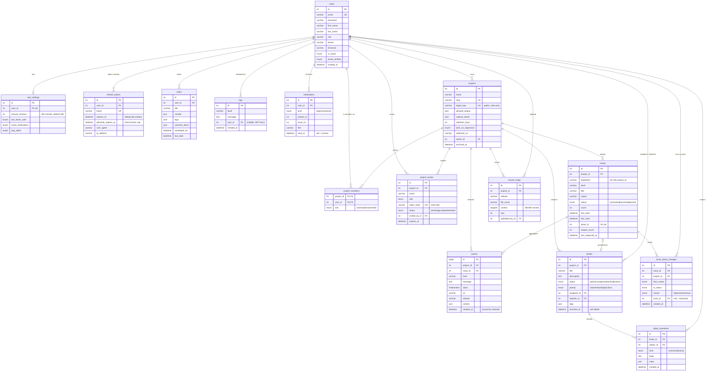
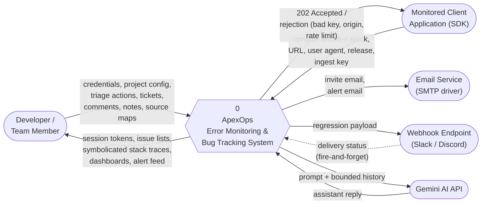

# ApexOps — ER Diagram (MySQL) & DFD Level 0–1

Derived from [`database/prisma/schema.prisma`](../../../database/prisma/schema.prisma) and the route
surface in `app/server/src/api/`, as of 2026-08-07.

> **Scope note.** The running system is PostgreSQL. This document renders the same logical model
> as a **MySQL 8.0** physical schema for documentation/coursework purposes. The MySQL DDL below is
> a faithful translation, not a migration path — see [Translation notes](#mysql-translation-notes)
> for the four places where MySQL genuinely behaves differently.

---

## 1. ER Diagram

15 entities. The spine is **User → Project → Issue → Event**; everything else hangs off that.



### Cardinality summary

| Relationship | Card. | Delete rule | Note |
|---|---|---|---|
| users → user_settings | 1 : 0..1 | CASCADE | one settings row per account |
| users → refresh_tokens | 1 : N | CASCADE | one row per active session |
| users → projects (owner) | 1 : N | CASCADE | deleting an owner destroys their workspaces |
| projects ↔ users | M : N | CASCADE | resolved by `project_members` (composite PK) |
| projects → issues | 1 : N | CASCADE | unique on `(project_id, fingerprint)` |
| issues → events | 1 : N | CASCADE | the 10^8-row table; `BIGINT` PK |
| issues ↔ tickets | 0..1 : 0..1 | SET NULL | promotion link, `issues.ticket_id` is UNIQUE |
| issues → issue_status_changes | 1 : N | CASCADE | append-only audit; source of truth for regressions |
| tickets → ticket_comments | 1 : N | CASCADE | comments + system activity in one stream |
| users → tickets | 1 : N ×2 | SET NULL | two roles: assignee and reporter |
| projects → source_maps | 1 : N | CASCADE | unique on `(project_id, release, file_name)` |
| users → notifications | 1 : N | CASCADE | fan-out is one row **per member per event** |

Two modelling choices worth naming, because they look like denormalisation bugs and are not:

- **`issues.count`, `reopen_count`, `last_reopened_at`** duplicate what `events` and
  `issue_status_changes` already imply. They exist because the issue list is the hottest read in
  the product and a per-row join to compute them would be paid on every page load. They are
  written in the same transaction as the audit row.
- **`events.project_id` and `issue_status_changes.project_id`** are reachable via `issue_id`. They
  are carried anyway so the retention prune and the cross-project roll-up don't join through
  `issues` on every row.

---

## 2. MySQL DDL

> **Runnable / importable version:** [`database/mysql/apexops_mysql.sql`](../../../database/mysql/apexops_mysql.sql).
> That file is the one to feed MySQL Workbench — it is FK-ordered, fully backtick-quoted, and
> carries table/column `COMMENT`s that show up in the EER diagram.
>
> `File → Import → Reverse Engineer MySQL Create Script…` → tick **"Place imported objects on a
> diagram"**. Or run the script on a server and use `Database → Reverse Engineer…`.

```sql
CREATE DATABASE IF NOT EXISTS apexops
  CHARACTER SET utf8mb4 COLLATE utf8mb4_0900_ai_ci;
USE apexops;

-- ── Users ───────────────────────────────────────────────────────────────
CREATE TABLE users (
  id             INT UNSIGNED NOT NULL AUTO_INCREMENT,
  first_name     VARCHAR(100)  NOT NULL,
  last_name      VARCHAR(100)  NOT NULL,
  email          VARCHAR(255)  NOT NULL,
  password       VARCHAR(255)  NOT NULL,          -- bcrypt hash
  phone          VARCHAR(32)   NULL,
  company        VARCHAR(150)  NULL,
  position       VARCHAR(150)  NULL,
  location       VARCHAR(150)  NULL,
  timezone       VARCHAR(64)   NULL DEFAULT 'Asia/Bangkok (GMT+7)',
  bio            TEXT          NULL,
  avatar_url     VARCHAR(1024) NULL,
  role           VARCHAR(32)   NULL DEFAULT 'user',
  gender         VARCHAR(32)   NULL,
  birth_date     DATE          NULL,
  language       VARCHAR(64)   NULL DEFAULT 'ไทย (Thai)',
  theme          VARCHAR(16)   NULL DEFAULT 'system',   -- light | dark | system
  is_active      TINYINT(1)    NULL DEFAULT 1,
  email_verified TINYINT(1)    NULL DEFAULT 0,
  created_at     DATETIME(3)   NOT NULL DEFAULT CURRENT_TIMESTAMP(3),
  updated_at     DATETIME(3)   NOT NULL DEFAULT CURRENT_TIMESTAMP(3)
                                   ON UPDATE CURRENT_TIMESTAMP(3),
  PRIMARY KEY (id),
  UNIQUE KEY uq_users_email (email)
) ENGINE=InnoDB;

-- ── User settings (1:1) ─────────────────────────────────────────────────
CREATE TABLE user_settings (
  id                  INT UNSIGNED NOT NULL AUTO_INCREMENT,
  user_id             INT UNSIGNED NOT NULL,
  email_notifications TINYINT(1) NOT NULL DEFAULT 1,
  push_notifications  TINYINT(1) NOT NULL DEFAULT 1,
  bug_alerts          TINYINT(1) NOT NULL DEFAULT 1,
  weekly_reports      TINYINT(1) NOT NULL DEFAULT 0,
  team_updates        TINYINT(1) NOT NULL DEFAULT 1,
  two_factor_auth     TINYINT(1) NOT NULL DEFAULT 0,
  session_timeout     INT NOT NULL DEFAULT 480,     -- idle minutes
  login_alerts        TINYINT(1) NOT NULL DEFAULT 1,
  profile_visibility  TINYINT(1) NOT NULL DEFAULT 1,
  activity_status     TINYINT(1) NOT NULL DEFAULT 1,
  data_collection     TINYINT(1) NOT NULL DEFAULT 0,
  created_at DATETIME(3) NOT NULL DEFAULT CURRENT_TIMESTAMP(3),
  updated_at DATETIME(3) NOT NULL DEFAULT CURRENT_TIMESTAMP(3)
                             ON UPDATE CURRENT_TIMESTAMP(3),
  PRIMARY KEY (id),
  UNIQUE KEY uq_user_settings_user (user_id),
  CONSTRAINT fk_user_settings_user FOREIGN KEY (user_id)
    REFERENCES users(id) ON DELETE CASCADE
) ENGINE=InnoDB;

-- ── Refresh tokens / sessions ───────────────────────────────────────────
CREATE TABLE refresh_tokens (
  id         INT UNSIGNED NOT NULL AUTO_INCREMENT,
  user_id    INT UNSIGNED NOT NULL,
  token      VARCHAR(255) NOT NULL,
  expires_at DATETIME(3)  NOT NULL,       -- sliding idle window
  absolute_expires_at DATETIME(3) NULL,   -- hard cap, carried across rotations
  user_agent VARCHAR(512) NULL,
  ip_address VARCHAR(45)  NULL,           -- IPv6-safe
  created_at DATETIME(3)  NOT NULL DEFAULT CURRENT_TIMESTAMP(3),
  PRIMARY KEY (id),
  UNIQUE KEY uq_refresh_tokens_token (token),
  KEY idx_refresh_tokens_user (user_id),
  CONSTRAINT fk_refresh_tokens_user FOREIGN KEY (user_id)
    REFERENCES users(id) ON DELETE CASCADE
) ENGINE=InnoDB;

-- ── Server logs (ApexOps' own, trusted) ─────────────────────────────────
CREATE TABLE logs (
  id         INT UNSIGNED NOT NULL AUTO_INCREMENT,
  level      VARCHAR(16)  NOT NULL,
  message    TEXT         NOT NULL,
  source     VARCHAR(255) NULL,
  stack      MEDIUMTEXT   NULL,
  user_id    INT UNSIGNED NULL,
  created_at DATETIME(3)  NOT NULL DEFAULT CURRENT_TIMESTAMP(3),
  PRIMARY KEY (id),
  KEY idx_logs_user (user_id),
  KEY idx_logs_created (created_at),
  CONSTRAINT fk_logs_user FOREIGN KEY (user_id)
    REFERENCES users(id) ON DELETE SET NULL
) ENGINE=InnoDB;

-- ── Notes / calendar ────────────────────────────────────────────────────
CREATE TABLE notes (
  id              INT UNSIGNED NOT NULL AUTO_INCREMENT,
  user_id         INT UNSIGNED NULL,
  title           VARCHAR(255) NOT NULL,
  content         MEDIUMTEXT   NULL,
  type            VARCHAR(32)  NULL DEFAULT 'text',
  is_pinned       TINYINT(1)   NOT NULL DEFAULT 0,
  color           VARCHAR(32)  NULL,
  tags            JSON         NOT NULL,
  image_url       VARCHAR(1024) NULL,
  link_url        VARCHAR(1024) NULL,
  checklist_items JSON         NOT NULL,
  quote           JSON         NOT NULL,
  scheduled_for   DATETIME(3)  NULL,
  due_date        DATETIME(3)  NULL,
  created_at      DATETIME(3)  NOT NULL DEFAULT CURRENT_TIMESTAMP(3),
  updated_at      DATETIME(3)  NOT NULL DEFAULT CURRENT_TIMESTAMP(3)
                                   ON UPDATE CURRENT_TIMESTAMP(3),
  PRIMARY KEY (id),
  KEY idx_notes_user (user_id),
  KEY idx_notes_pinned (is_pinned),
  KEY idx_notes_user_scheduled (user_id, scheduled_for),
  KEY idx_notes_user_due (user_id, due_date),
  CONSTRAINT fk_notes_user FOREIGN KEY (user_id)
    REFERENCES users(id) ON DELETE CASCADE
) ENGINE=InnoDB;
-- MySQL 8.0.13+ only; on 5.7 drop these and default in the application layer.
ALTER TABLE notes
  ALTER COLUMN tags            SET DEFAULT (JSON_ARRAY()),
  ALTER COLUMN checklist_items SET DEFAULT (JSON_ARRAY()),
  ALTER COLUMN quote           SET DEFAULT (JSON_OBJECT());

-- ── Projects / workspaces ───────────────────────────────────────────────
CREATE TABLE projects (
  id              INT UNSIGNED NOT NULL AUTO_INCREMENT,
  name            VARCHAR(150) NOT NULL,
  slug            VARCHAR(100) NOT NULL,
  ingest_key      VARCHAR(64)  NOT NULL,   -- public, write-only, rotatable
  allowed_origins JSON NOT NULL,
  capture_levels  JSON NOT NULL,
  retention_days  INT  NOT NULL DEFAULT 30,
  alert_on_regression TINYINT(1) NOT NULL DEFAULT 1,
  webhook_url     VARCHAR(2048) NULL,      -- user-supplied => SSRF-guarded
  owner_id        INT UNSIGNED NOT NULL,
  archived_at     DATETIME(3) NULL,
  created_at      DATETIME(3) NOT NULL DEFAULT CURRENT_TIMESTAMP(3),
  updated_at      DATETIME(3) NOT NULL DEFAULT CURRENT_TIMESTAMP(3)
                                  ON UPDATE CURRENT_TIMESTAMP(3),
  PRIMARY KEY (id),
  UNIQUE KEY uq_projects_slug (slug),
  UNIQUE KEY uq_projects_ingest_key (ingest_key),
  KEY idx_projects_owner (owner_id),
  KEY idx_projects_archived (archived_at),
  CONSTRAINT fk_projects_owner FOREIGN KEY (owner_id)
    REFERENCES users(id) ON DELETE CASCADE
) ENGINE=InnoDB;
ALTER TABLE projects
  ALTER COLUMN allowed_origins SET DEFAULT (JSON_ARRAY()),
  ALTER COLUMN capture_levels  SET DEFAULT (JSON_ARRAY('error','warn'));

-- ── Project membership (M:N resolver) ───────────────────────────────────
CREATE TABLE project_members (
  project_id INT UNSIGNED NOT NULL,
  user_id    INT UNSIGNED NOT NULL,
  role       ENUM('owner','admin','member') NOT NULL DEFAULT 'member',
  created_at DATETIME(3) NOT NULL DEFAULT CURRENT_TIMESTAMP(3),
  PRIMARY KEY (project_id, user_id),
  KEY idx_project_members_user (user_id),
  CONSTRAINT fk_project_members_project FOREIGN KEY (project_id)
    REFERENCES projects(id) ON DELETE CASCADE,
  CONSTRAINT fk_project_members_user FOREIGN KEY (user_id)
    REFERENCES users(id) ON DELETE CASCADE
) ENGINE=InnoDB;

-- ── Invites ─────────────────────────────────────────────────────────────
CREATE TABLE project_invites (
  id            INT UNSIGNED NOT NULL AUTO_INCREMENT,
  project_id    INT UNSIGNED NOT NULL,
  email         VARCHAR(255) NOT NULL,   -- lowercased at write time
  role          ENUM('owner','admin','member') NOT NULL DEFAULT 'member',
  token_hash    CHAR(64) NOT NULL,       -- SHA-256 hex; raw token never stored
  status        ENUM('pending','accepted','revoked') NOT NULL DEFAULT 'pending',
  invited_by_id INT UNSIGNED NOT NULL,
  expires_at    DATETIME(3) NOT NULL,
  accepted_at   DATETIME(3) NULL,
  accepted_by_id INT UNSIGNED NULL,
  created_at    DATETIME(3) NOT NULL DEFAULT CURRENT_TIMESTAMP(3),
  PRIMARY KEY (id),
  UNIQUE KEY uq_project_invites_token (token_hash),
  UNIQUE KEY uq_project_invites_project_email (project_id, email),
  KEY idx_project_invites_project_status (project_id, status),
  CONSTRAINT fk_project_invites_project FOREIGN KEY (project_id)
    REFERENCES projects(id) ON DELETE CASCADE,
  CONSTRAINT fk_project_invites_inviter FOREIGN KEY (invited_by_id)
    REFERENCES users(id) ON DELETE CASCADE
) ENGINE=InnoDB;

-- ── Tickets (bug tracker board) ─────────────────────────────────────────
CREATE TABLE tickets (
  id           INT UNSIGNED NOT NULL AUTO_INCREMENT,
  project_id   INT UNSIGNED NOT NULL,
  title        VARCHAR(255) NOT NULL,
  description  MEDIUMTEXT NULL,
  status       ENUM('open','in-progress','resolved','closed') NOT NULL DEFAULT 'open',
  priority     ENUM('low','medium','high','critical') NOT NULL DEFAULT 'medium',
  assignee     VARCHAR(150) NULL,   -- legacy display denorm
  reporter     VARCHAR(150) NULL DEFAULT 'System',
  assignee_id  INT UNSIGNED NULL,
  reporter_id  INT UNSIGNED NULL,
  tags         JSON NOT NULL,
  related_logs JSON NOT NULL,
  archived_at  DATETIME(3) NULL,    -- soft delete
  created_at   DATETIME(3) NOT NULL DEFAULT CURRENT_TIMESTAMP(3),
  updated_at   DATETIME(3) NOT NULL DEFAULT CURRENT_TIMESTAMP(3)
                                ON UPDATE CURRENT_TIMESTAMP(3),
  PRIMARY KEY (id),
  KEY idx_tickets_project_status (project_id, status),
  KEY idx_tickets_assignee (assignee_id),
  KEY idx_tickets_reporter (reporter_id),
  KEY idx_tickets_status (status),
  KEY idx_tickets_archived (archived_at),
  CONSTRAINT fk_tickets_project FOREIGN KEY (project_id)
    REFERENCES projects(id) ON DELETE CASCADE,
  CONSTRAINT fk_tickets_assignee FOREIGN KEY (assignee_id)
    REFERENCES users(id) ON DELETE SET NULL,
  CONSTRAINT fk_tickets_reporter FOREIGN KEY (reporter_id)
    REFERENCES users(id) ON DELETE SET NULL
) ENGINE=InnoDB;
ALTER TABLE tickets
  ALTER COLUMN tags         SET DEFAULT (JSON_ARRAY()),
  ALTER COLUMN related_logs SET DEFAULT (JSON_ARRAY());

CREATE TABLE ticket_comments (
  id         INT UNSIGNED NOT NULL AUTO_INCREMENT,
  ticket_id  INT UNSIGNED NOT NULL,
  author_id  INT UNSIGNED NULL,
  kind       ENUM('comment','activity') NOT NULL DEFAULT 'comment',
  body       MEDIUMTEXT NOT NULL,
  meta       JSON NOT NULL,   -- { field, from, to } for activity rows
  created_at DATETIME(3) NOT NULL DEFAULT CURRENT_TIMESTAMP(3),
  updated_at DATETIME(3) NOT NULL DEFAULT CURRENT_TIMESTAMP(3)
                             ON UPDATE CURRENT_TIMESTAMP(3),
  PRIMARY KEY (id),
  KEY idx_ticket_comments_ticket_created (ticket_id, created_at),
  KEY idx_ticket_comments_author (author_id),
  CONSTRAINT fk_ticket_comments_ticket FOREIGN KEY (ticket_id)
    REFERENCES tickets(id) ON DELETE CASCADE,
  CONSTRAINT fk_ticket_comments_author FOREIGN KEY (author_id)
    REFERENCES users(id) ON DELETE SET NULL
) ENGINE=InnoDB;
ALTER TABLE ticket_comments ALTER COLUMN meta SET DEFAULT (JSON_OBJECT());

-- ── Issues (grouped, deduplicated errors) ───────────────────────────────
CREATE TABLE issues (
  id          INT UNSIGNED NOT NULL AUTO_INCREMENT,
  project_id  INT UNSIGNED NOT NULL,
  fingerprint CHAR(64) NOT NULL,   -- hash(project, level, norm(message), top frame)
  level       VARCHAR(16)  NOT NULL,
  title       VARCHAR(512) NOT NULL,
  culprit     VARCHAR(512) NULL,
  status      ENUM('unresolved','resolved','ignored') NOT NULL DEFAULT 'unresolved',
  count       INT UNSIGNED NOT NULL DEFAULT 1,
  first_seen  DATETIME(3) NOT NULL DEFAULT CURRENT_TIMESTAMP(3),
  last_seen   DATETIME(3) NOT NULL DEFAULT CURRENT_TIMESTAMP(3),
  ticket_id   INT UNSIGNED NULL,
  reopen_count     INT UNSIGNED NOT NULL DEFAULT 0,
  last_reopened_at DATETIME(3) NULL,
  PRIMARY KEY (id),
  UNIQUE KEY uq_issues_project_fingerprint (project_id, fingerprint), -- ingest upsert target
  UNIQUE KEY uq_issues_ticket (ticket_id),
  KEY idx_issues_project_status_lastseen (project_id, status, last_seen),
  CONSTRAINT fk_issues_project FOREIGN KEY (project_id)
    REFERENCES projects(id) ON DELETE CASCADE,
  CONSTRAINT fk_issues_ticket FOREIGN KEY (ticket_id)
    REFERENCES tickets(id) ON DELETE SET NULL
) ENGINE=InnoDB;

-- ── Events (raw occurrences, retention-pruned) ──────────────────────────
CREATE TABLE events (
  id         BIGINT UNSIGNED NOT NULL AUTO_INCREMENT,  -- 10^8-row table
  project_id INT UNSIGNED NOT NULL,
  issue_id   INT UNSIGNED NOT NULL,
  level      VARCHAR(16)  NOT NULL,
  message    TEXT         NOT NULL,
  stack      MEDIUMTEXT   NULL,
  url        VARCHAR(2048) NULL,
  user_agent VARCHAR(512) NULL,
  `release`  VARCHAR(191) NULL,          -- matches source_maps.release
  context    JSON NOT NULL,
  created_at DATETIME(3) NOT NULL DEFAULT CURRENT_TIMESTAMP(3),
  PRIMARY KEY (id),
  KEY idx_events_issue_created (issue_id, created_at),
  KEY idx_events_project_created (project_id, created_at),  -- retention prune
  CONSTRAINT fk_events_project FOREIGN KEY (project_id)
    REFERENCES projects(id) ON DELETE CASCADE,
  CONSTRAINT fk_events_issue FOREIGN KEY (issue_id)
    REFERENCES issues(id) ON DELETE CASCADE
) ENGINE=InnoDB;
ALTER TABLE events ALTER COLUMN context SET DEFAULT (JSON_OBJECT());

-- ── Issue status audit ──────────────────────────────────────────────────
CREATE TABLE issue_status_changes (
  id          INT UNSIGNED NOT NULL AUTO_INCREMENT,
  issue_id    INT UNSIGNED NOT NULL,
  project_id  INT UNSIGNED NOT NULL,     -- denormalized for the roll-up
  from_status ENUM('unresolved','resolved','ignored') NOT NULL,
  to_status   ENUM('unresolved','resolved','ignored') NOT NULL,
  reason      ENUM('regression','manual') NOT NULL,
  actor_id    INT UNSIGNED NULL,         -- NULL for automatic regressions
  created_at  DATETIME(3) NOT NULL DEFAULT CURRENT_TIMESTAMP(3),
  PRIMARY KEY (id),
  KEY idx_isc_issue_created (issue_id, created_at),
  KEY idx_isc_project_reason_created (project_id, reason, created_at),
  CONSTRAINT fk_isc_issue FOREIGN KEY (issue_id)
    REFERENCES issues(id) ON DELETE CASCADE,
  CONSTRAINT fk_isc_actor FOREIGN KEY (actor_id)
    REFERENCES users(id) ON DELETE SET NULL
) ENGINE=InnoDB;

-- ── Notifications (system of record for alerting) ───────────────────────
CREATE TABLE notifications (
  id         INT UNSIGNED NOT NULL AUTO_INCREMENT,
  user_id    INT UNSIGNED NOT NULL,
  kind       ENUM('regression','invite') NOT NULL,
  project_id INT UNSIGNED NOT NULL,      -- denormalized for feed filtering
  issue_id   INT UNSIGNED NULL,
  title      VARCHAR(512) NOT NULL,
  body       TEXT NULL,
  read_at    DATETIME(3) NULL,           -- NULL = unread
  created_at DATETIME(3) NOT NULL DEFAULT CURRENT_TIMESTAMP(3),
  PRIMARY KEY (id),
  KEY idx_notifications_feed (user_id, read_at, created_at),
  CONSTRAINT fk_notifications_user FOREIGN KEY (user_id)
    REFERENCES users(id) ON DELETE CASCADE
) ENGINE=InnoDB;

-- ── Source maps (never served) ──────────────────────────────────────────
CREATE TABLE source_maps (
  id         INT UNSIGNED NOT NULL AUTO_INCREMENT,
  project_id INT UNSIGNED NOT NULL,
  `release`  VARCHAR(191) NOT NULL,
  file_name  VARCHAR(191) NOT NULL,   -- basename only, e.g. index-BwlN_KfP.js
  content    LONGTEXT NOT NULL,       -- raw .map JSON; NO endpoint returns this
  size       INT UNSIGNED NOT NULL,
  uploaded_by_id INT UNSIGNED NULL,
  created_at DATETIME(3) NOT NULL DEFAULT CURRENT_TIMESTAMP(3),
  updated_at DATETIME(3) NOT NULL DEFAULT CURRENT_TIMESTAMP(3)
                             ON UPDATE CURRENT_TIMESTAMP(3),
  PRIMARY KEY (id),
  UNIQUE KEY uq_source_maps_project_release_file (project_id, `release`, file_name),
  KEY idx_source_maps_project_release (project_id, `release`),
  CONSTRAINT fk_source_maps_project FOREIGN KEY (project_id)
    REFERENCES projects(id) ON DELETE CASCADE,
  CONSTRAINT fk_source_maps_uploader FOREIGN KEY (uploaded_by_id)
    REFERENCES users(id) ON DELETE SET NULL
) ENGINE=InnoDB;
```

### MySQL translation notes

Four differences that are behavioural, not cosmetic — read these before treating the DDL as
equivalent to the running Postgres schema.

1. **Email uniqueness becomes case-insensitive.** `utf8mb4_0900_ai_ci` collation means
   `Ann@x.com` and `ann@x.com` collide on `uq_users_email`, where Postgres treats them as two
   accounts. This is arguably the better behaviour, but it is a *silent semantic change* — an
   existing Postgres dataset with both rows will fail to import. Use `utf8mb4_0900_as_cs` on the
   email column to preserve current behaviour exactly.
2. **`JSON` columns cannot take a literal `DEFAULT`.** MySQL 8.0.13+ allows only expression
   defaults, hence the trailing `ALTER TABLE … SET DEFAULT (JSON_ARRAY())` statements. On MySQL
   5.7 there is no option: the application must supply the value on every insert.
3. **Index key length.** InnoDB caps an index key at 3072 bytes, and `utf8mb4` charges 4 bytes per
   character — so `VARCHAR(191)` is the safe ceiling for any indexed string. That is why
   `source_maps.release` and `file_name` are 191 and not 255; their composite unique key would
   otherwise exceed the limit.
4. **`LONGTEXT` needs `max_allowed_packet` raised.** Source maps of several MB will be rejected by
   the default 64MB-in-8.0 / 4MB-in-older packet limit on the *client* side before the column ever
   objects. Set it explicitly wherever the uploader runs.

Also note `events.release` and `source_maps.release` are backtick-quoted: `RELEASE` is a reserved
word in MySQL (`RELEASE SAVEPOINT`) where it is not in Postgres.

---

## 3. DFD Level 0 — Context Diagram

One process, five external entities. Everything the system stores is internal at this level.



**Why these five and not more.** The SDK is a separate external entity from the developer even
though the same company owns both: it authenticates differently (public ingest key vs. JWT
session), it is *untrusted, attacker-controllable input*, and it is write-only. Collapsing it into
"user" hides the single most important trust boundary in the system.

The dashed return from the webhook is deliberate — delivery is fire-and-forget, which is exactly
why the `notifications` row is written first and unconditionally at Level 1.

---

## 4. DFD Level 1 — Decomposition of Process 0

```mermaid
flowchart TB
    DEV(["Developer /<br/>Team Member"])
    APP(["Monitored Client App<br/>(SDK)"])
    MAIL(["Email Service"])
    HOOK(["Webhook Endpoint"])
    AI(["Gemini AI API"])

    P1["1.0<br/>Authenticate &<br/>Manage Session"]
    P2["2.0<br/>Manage Projects,<br/>Members & Invites"]
    P3["3.0<br/>Ingest & Group<br/>Errors"]
    P4["4.0<br/>Triage Issues &<br/>Track Regressions"]
    P5["5.0<br/>Manage Bug<br/>Tickets"]
    P6["6.0<br/>Manage Source Maps<br/>& Symbolicate"]
    P7["7.0<br/>Generate &<br/>Deliver Alerts"]
    P8["8.0<br/>Manage Notes<br/>& Calendar"]
    P9["9.0<br/>Report Overview<br/>& Analytics"]
    P10["10.0<br/>Proxy AI<br/>Assistant"]
    P11["11.0<br/>Prune by<br/>Retention"]

    D1[("D1 users / user_settings")]
    D2[("D2 refresh_tokens")]
    D3[("D3 projects / project_members / project_invites")]
    D4[("D4 issues")]
    D5[("D5 events")]
    D6[("D6 issue_status_changes")]
    D7[("D7 tickets / ticket_comments")]
    D8[("D8 source_maps")]
    D9[("D9 notifications")]
    D10[("D10 notes")]
    D11[("D11 logs")]

    DEV -->|"email + password"| P1
    P1 -->|"access + refresh token"| DEV
    P1 <-->|"credential + role lookup,<br/>session_timeout"| D1
    P1 <-->|"issue / rotate / revoke"| D2

    DEV -->|"project settings,<br/>invite, role change"| P2
    P2 -->|"project list, ingest key,<br/>member roster"| DEV
    P2 <-->|"read / write"| D3
    P2 -->|"invite token hash"| D3
    P2 -->|"invite link"| MAIL
    P2 -->|"in-app invite row"| D9

    APP -->|"ingest key + error payload"| P3
    P3 -->|"key / origin / rate check"| D3
    P3 -->|"upsert by (project, fingerprint),<br/>count++, last_seen"| D4
    P3 -->|"append raw occurrence"| D5
    P3 -->|"regression detected:<br/>resolved -> unresolved"| P4
    P3 -->|"202 / rejected"| APP

    DEV -->|"resolve / ignore / reopen"| P4
    P4 <-->|"status, reopen_count"| D4
    P4 -->|"append audit row"| D6
    P4 -->|"regression event"| P7
    P4 -->|"issue detail request"| P6
    P4 -->|"issue list + status"| DEV

    DEV -->|"promote issue,<br/>edit ticket, comment"| P5
    P5 <-->|"read / write"| D7
    P5 -->|"link ticket_id"| D4
    P5 -->|"board + thread"| DEV

    DEV -->|"upload .map (release, file)"| P6
    P6 -->|"store content (never served)"| D8
    P6 -->|"read minified frames"| D5
    P6 -->|"original file / line /<br/>function only"| P4

    P7 -->|"write row per member<br/>(system of record)"| D9
    P7 -->|"member fan-out list"| D3
    P7 -->|"regression payload<br/>(SSRF-guarded URL)"| HOOK
    P7 -->|"alert email"| MAIL
    D9 -->|"unread feed"| P7
    P7 -->|"alert feed + badge"| DEV

    DEV -->|"note, schedule, due date"| P8
    P8 <-->|"read / write"| D10
    P8 -->|"calendar + note list"| DEV

    P9 -->|"counts by status"| D4
    P9 -->|"regressions in window"| D6
    P9 -->|"ticket throughput"| D7
    P9 -->|"roll-up dashboard"| DEV

    DEV -->|"prompt (auth'd, quota'd,<br/>length-capped)"| P10
    P10 -->|"bounded request"| AI
    AI -->|"reply"| P10
    P10 -->|"assistant response"| DEV

    P11 -->|"retention_days"| D3
    P11 -->|"delete events older<br/>than window"| D5

    P1 -->|"auth events"| D11
    P3 -->|"ingest errors"| D11
```



### Process catalogue

| # | Process | Trigger | Reads | Writes | Code |
|---|---|---|---|---|---|
| 1.0 | Authenticate & manage session | user login / token refresh | D1, D2 | D2, D11 | `api/auth.ts`, `lib/sessions.ts` |
| 2.0 | Manage projects, members, invites | user action | D1, D3 | D3, D9 | `api/projects.ts`, `team.ts`, `invites.ts` |
| 3.0 | Ingest & group errors | SDK POST | D3, D4 | D4, D5, D11 | `api/ingest.ts`, `lib/fingerprint.ts` |
| 4.0 | Triage issues & track regressions | user action **or** 3.0 | D4, D5 | D4, D6 | `api/issues.ts` |
| 5.0 | Manage bug tickets | user action | D3, D7 | D4, D7 | `api/tickets.ts` |
| 6.0 | Source maps & symbolication | upload / issue read | D5, D8 | D8 | `api/sourcemaps.ts`, `lib/sourcemaps.ts`, `lib/stackFrames.ts` |
| 7.0 | Generate & deliver alerts | regression from 4.0 | D3, D9 | D9 | `lib/alerts.ts`, `lib/webhook.ts`, `lib/mail.ts` |
| 8.0 | Notes & calendar | user action | D10 | D10 | `api/notes.ts` |
| 9.0 | Overview & analytics | dashboard load | D4, D6, D7 | — | `api/overview.ts`, `lib/eventAnalytics.ts` |
| 10.0 | AI assistant proxy | user prompt | D1 (quota) | — | `api/ai.ts` |
| 11.0 | Retention prune | scheduled | D3 | D5 | `lib/retention.ts` |

### Three flows that carry the system's real constraints

- **3.0 → 4.0 (regression path).** Ingest is the only process that changes an issue's status
  without a human actor. That is why `issue_status_changes.actor_id` is nullable and why the audit
  row exists at all — without it, "3 regressions this week" is uncomputable.
- **7.0 writes D9 *before* it calls the webhook.** A silently-dead webhook is indistinguishable
  from "nothing broke", which is the worst failure a monitoring tool can have. The durable row is
  the record of what we tried to say; the outbound call is best-effort.
- **6.0 → 4.0 returns positions, never content.** `source_maps.content` is customer source. Only
  resolved file/line/function crosses that arrow. No process, at any level, has a flow from D8 to
  an external entity.

---

## Open items

- **Chat (`api/chat.ts`) is intentionally absent from the DFD.** It has no data store — messages
  are in-memory over the socket and do not survive a restart. Adding it to Level 1 would imply a
  persistence flow that does not exist. Add `messages` / `conversations` entities when
  persistence lands.
- `tickets.assignee` / `tickets.reporter` (free-text) are a transitional denorm alongside the FK
  columns. They should disappear from the ER diagram once no read path uses them.
