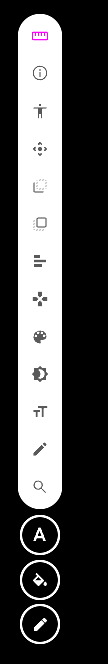

# Browser extension + web app — แผนละเอียดและความเสี่ยง

**สถานะ: แผนเท่านั้น ยังไม่มีการแก้โค้ด** — เขียน 2026-09-18 ตรวจกับ `main` ที่ `212c88b`
ทุกข้อที่อ้างไฟล์ด้านล่างเปิดดูจริงแล้ว ข้อที่ยังไม่ได้ยืนยันเขียนกำกับว่า "ยังไม่ยืนยัน"

> **แก้ขอบเขต 2026-09-19 (ตรวจกับ `08e3a85`):** UI หลักของ extension เปลี่ยนจาก popup เป็น **Floating Toolbar / Menu
> บนหน้าเว็บที่กำลัง test** และเชื่อมกับ web app ด้วยการ **วาง URL ของ project** (`<web app>/p/<slug>/...`)
> ส่วนที่เปลี่ยนอยู่ใน **ข้อ 8** — ข้อ 1–7 ยังใช้ได้ ยกเว้น P4 ถูกแทนด้วย P4/P5 ใหม่ และเลข phase หลังจากนั้นเลื่อน

**เป้าหมาย:** มีทั้ง web app (`app/client` ตัวเดิม) และ browser extension (Chrome/Edge ก่อน, Firefox ตามมา)
โดยใช้โค้ดชุดเดียวกันสำหรับ auth, API client, types และตัวดักจับ console ไม่ copy แยกสองชุด

**Extension ทำอะไร (v1)**
1. ดักจับ error/warn จากเว็บที่ผู้ใช้เลือกเปิดทีละเว็บ แล้วส่งเข้า project ใน ApexOps
2. Popup: login, ดู issue ล่าสุดของ project, badge แจ้ง issue ใหม่
3. ปุ่ม "Report bug" สร้าง ticket จาก tab ปัจจุบัน (URL + title + ข้อความ) — screenshot แยกเป็น phase ของมันเอง

---

## 1. สิ่งที่พบจากการตรวจโค้ด (ข้อเท็จจริงที่กำหนดแผน)

| # | สิ่งที่พบ | ที่ไหน | ผลต่อแผน |
|---|---|---|---|
| F1 | Auth ใช้ **Bearer token** ใน header ไม่ใช่ cookie | `api/config.ts`, `lib/authSession.ts` | extension เรียก API เดิมได้ ไม่ติด SameSite/third-party cookie |
| F2 | แผน auth **Phase 4 (A7)** กำลังพิจารณาย้าย refresh token ไป httpOnly cookie | `.agents/docs/planning/auth-review-and-restructure-2026-08-25.md` | **ชนกับ extension โดยตรง** — ถ้าทำ phase 4 แบบ cookie อย่างเดียว extension จะ login ไม่ได้ ดู R1 |
| F3 | `authSession.ts` อ่าน/เขียน `localStorage` แบบ **sync** | `lib/authSession.ts` | service worker ของ MV3 **ไม่มี `localStorage`** ต้องเปลี่ยนเป็น storage adapter แบบ async |
| F4 | มีโค้ดอ่าน token จาก `localStorage` **ตรงๆ ไม่ผ่าน authSession อีก 5 จุด** | `api/config.ts:14`, `context/AuthContext.tsx:72,132`, `services/auth.ts:93,96`, `dev/devSessions.ts:228-229` | ต้องรวมให้ผ่าน authSession ก่อนแยก package ไม่งั้นสองฝั่งจะเพี้ยนกันเงียบๆ |
| F5 | API base URL มาจาก `import.meta.env.VITE_API_URL` ตอน **build** | `api/config.ts:6` | extension ต้องให้ผู้ใช้กรอก server URL ตอนใช้งาน (self-host) ต้องเป็นค่า runtime |
| F6 | `/sdk/v1.js` อ่าน config จาก `document.currentScript.dataset` | `server/public/sdk/v1.js:47-56` | ตอน extension inject **ไม่มี script tag** ต้องแยก core ออกมาให้รับ config เป็น argument |
| F7 | SDK มี re-entrancy guard (`inside`) และเรียก console เดิมก่อนเสมอ | `sdk/v1.js:29-41, 249-268` | ดีแล้ว ต้องคงไว้ตอนแยก core |
| F8 | `/api/ingest` มี **origin allowlist** ต่อ project; ไม่มี `Origin` = ปฏิเสธ | `api/ingest.ts:155-164` | ถ้าส่งจาก service worker, `Origin` = `chrome-extension://<id>` → **403** กับ project ที่ตั้ง allowlist ดู R6 |
| F9 | Ingest จำกัด rate ต่อ key และต่อ IP (in-memory), body 1 MB | `api/ingest.ts:49, 61-128` | extension บนเว็บที่ error เยอะอาจกิน quota ของ key จนตัว SDK จริงโดน 429 ดู R12 |
| F10 | `Event.context` เป็น `Json` อยู่แล้ว | `database/prisma/schema.prisma:592` | ติด tag `source: "extension"` ได้โดย **ไม่ต้องแก้ schema** (ต้องยืนยันว่า `ingest.schema.ts` รับ `context` ผ่าน — ยังไม่ยืนยัน) |
| F11 | `Ticket` **ไม่มี** field/ตารางไฟล์แนบ และทั้งระบบไม่มี file upload (source map เก็บใน Postgres) | `schema.prisma:669-691`, `api/sourcemaps.ts` | screenshot ต้องมีการตัดสินใจเรื่อง storage ใหม่ → แยกเป็น phase |
| F12 | Session เก็บ `userAgent` เพื่อแสดงในรายการ session | `lib/sessions.ts:87-90` | session ของ extension จะดูเหมือน "Chrome" ธรรมดา แยกไม่ออกจาก tab |
| F13 | Refresh token **ใช้ได้ครั้งเดียว** และกัน race ด้วย in-flight promise **ต่อ JS context** | `lib/authSession.ts` `refreshOnce()` | popup, service worker, options page เป็นคนละ context → refresh ชนกันได้ ดู R2 |
| F14 | `package-lock.json` ถูก track, CI ใช้ `npm ci` และรัน typecheck/test ทุก workspace | `.github/workflows/ci.yml` | เพิ่ม workspace = lockfile เปลี่ยน, CI ต้องรู้จัก workspace ใหม่ |
| F15 | Client build ใช้ `erasableSyntaxOnly` (`tsc --noEmit` จับไม่ได้ แต่ `npm run build` จับได้) | memory: client-build-erasable-syntax | `packages/shared` ห้ามใช้ `enum`/`namespace`/parameter properties |
| F16 | ไฟล์เก่า `server/public/bug-tracker-client.js` (WebSocket :8082 ที่ถูกลบไปแล้ว) ยังอยู่ | `server/public/` | **ห้ามใช้เป็นฐาน** ของ extension ให้ใช้ `/sdk/v1.js` |

---

## 2. การตัดสินใจที่ต้องล็อกก่อนเริ่ม

แต่ละข้อมีคำแนะนำ ถ้าไม่มีใครค้าน ถือตามคำแนะนำ

| # | คำถาม | แนะนำ | เหตุผล |
|---|---|---|---|
| **X1** | extension เก็บ token ที่ไหน | `chrome.storage.local` | `storage.session` หายเมื่อปิด browser = login ใหม่ทุกวัน; `local` ไม่ถูกเว็บอื่นอ่านได้ (ต่างจาก `localStorage` ของหน้าเว็บ) |
| **X2** | ใครเป็นเจ้าของการ refresh ใน extension | **service worker คนเดียว** popup/options ขอ token ผ่าน `chrome.runtime.sendMessage` | กัน refresh ชนกันข้าม context (R2) |
| **X3** | Auth Phase 4 จะทำอย่างไรกับ extension | บันทึกลงแผน auth ว่า **Bearer path ต้องคงอยู่สำหรับ client ที่ไม่ใช่เว็บ** ไม่ว่า phase 4 เลือกอะไร | ถ้าไม่เขียนไว้ phase 4 จะทำ extension พังโดยไม่มีใครรู้ (R1) |
| **X4** | event ที่ดักได้ส่งด้วยอะไร | **ingest key** (ไม่ใช่ JWT) และแนะนำให้สร้าง project แยก เช่น "Extension captures" | เส้นทาง capture ไม่มีสิทธิ์อะไรเลยนอกจากเขียน event; ไม่กิน quota ของ SDK จริง |
| **X5** | เปิดดักจับที่ไหน | **ปิดเป็นค่าเริ่มต้น** เปิดทีละ origin, ตัด query string และ `#hash` ออกจาก URL โดยค่าเริ่มต้น | ความเป็นส่วนตัว + ผ่าน review ของ Web Store ง่ายขึ้น (R7, R10) |
| **X6** | แจ้งเตือน issue ใหม่แบบไหน | **polling ด้วย `chrome.alarms`** (ทุก 1–5 นาที) ไม่ใช้ socket | socket ไม่ได้อยู่ใต้ระบบ refresh และ service worker ถูกปิดได้ทุกเมื่อ (R11) |
| **X7** | Screenshot | **แยก phase P5** ต้องเลือก storage ก่อน (Postgres `bytea` จำกัดขนาด / object storage) | ไม่มีที่เก็บไฟล์ในระบบเลย (F11) |
| **X8** | Framework | **WXT** (Vite + React), Chrome + Edge ก่อน, Firefox หลังผ่าน P6 | MV3 + multi-browser จากโค้ดชุดเดียว |
| **X9** | หน้าเว็บมี SDK อยู่แล้ว + extension inject ซ้ำ | ตรวจ marker `window.__apexopsSdk` ถ้ามีแล้ว extension **ไม่ inject** | กัน event ซ้ำสองเท่า (R8) |

---

## 3. สถาปัตยกรรม

```
apexops_i/
  app/client/        web app เดิม (import จาก @apexops/shared)
  app/server/        API เดิม; /sdk/v1.js build จาก shared/sdk-core
  app/extension/     ใหม่ (WXT)
    entrypoints/
      background.ts      service worker: เจ้าของ token, refresh, ส่ง ingest, alarms
      capture.main.ts    content script world:"MAIN" — patch console (sdk-core)
      bridge.content.ts  content script world:"ISOLATED" — ส่งต่อ event ไป SW
      popup/             React: login, issue ล่าสุด, Report bug
      options/           server URL, ingest key, รายชื่อเว็บที่เปิดดักจับ
packages/shared/     ใหม่
  src/auth/          authSession (รับ StorageAdapter), types
  src/api/           base URL (runtime), fetch helper + 401 retry
  src/sdk-core/      console patch, dedupe, batching — ไม่มี DOM/script-tag
  src/types/         types ที่ client และ extension ใช้ร่วม
```

**เส้นทางของ event ที่ดักได้** (ไม่ส่งจากหน้าเว็บโดยตรง เพราะ CSP `connect-src` ของหลายเว็บจะบล็อก):

```
หน้าเว็บ (MAIN world, sdk-core)
   └─ window.postMessage ─▶ bridge (ISOLATED)  ── ตรวจรูปแบบ + จำกัดขนาด
         └─ chrome.runtime.sendMessage ─▶ service worker
               └─ fetch POST /api/ingest  (X-Apexops-Key)
```

**กฎความปลอดภัยของ bridge:** หน้าเว็บปลอม `postMessage` ได้เสมอ ดังนั้น bridge **รับได้แค่ event สำหรับ ingest**
ห้ามมีข้อความใดจากหน้าเว็บที่ทำให้ SW ใช้ JWT, อ่าน token หรือเรียก API อื่น event ที่ถูกปลอมก็แค่เป็น event ปลอม
ซึ่ง SDK ปกติก็รับความเสี่ยงเดียวกันอยู่แล้ว (ingest key เป็น public โดยออกแบบ — D4 ของ project-workspaces spec)

**StorageAdapter** (หัวใจของ P1):

```ts
export interface StorageAdapter {
    get(key: string): Promise<string | null>;
    set(key: string, value: string): Promise<void>;
    remove(keys: string[]): Promise<void>;
}
```
web ส่ง adapter ที่ห่อ `localStorage` (resolve ทันที), extension ส่ง adapter ที่ห่อ `chrome.storage.local`

---

## 4. Phases

ทุก phase = หนึ่ง branch, เงื่อนไขปิด phase เขียนเป็น **สิ่งที่สังเกตได้** ไม่ใช่ "ทำเสร็จแล้ว"

### P0 — ล็อกการตัดสินใจ (0.5 วัน)
- ยืนยัน X1–X9 ในไฟล์นี้
- เพิ่มหมายเหตุ X3 ลงใน `planning/auth-review-and-restructure-2026-08-25.md` ส่วน phase 4
- ยืนยัน F10: `ingest.schema.ts` รับ `context` หรือไม่ (ถ้าไม่ ต้องเพิ่ม field — งานเล็ก)

### P1 — เตรียม web app โดยยังไม่แยก package (1–1.5 วัน) · branch `ext/p1-auth-storage`
งานทั้งหมดอยู่ใน `app/client` เพื่อให้ถ้าพัง รู้ทันทีว่าพังเพราะ refactor ไม่ใช่เพราะย้ายไฟล์
1. ย้ายการอ่าน token ตรงทั้ง 5 จุด (F4) ให้ผ่าน `authSession`
2. เปลี่ยน `authSession` เป็น async + `StorageAdapter`
   - `AuthContext.tsx:72` ใช้ `useState(() => !!localStorage...)` แบบ sync ตอน render แรก → ต้องออกแบบ initial state ใหม่ ไม่ให้หน้าแวบไป `/login` ก่อนอ่าน storage เสร็จ
   - `api/client.ts:81` และ `services/api.ts` เรียก `isExpired(getAccessToken())` แบบ sync → ต้อง `await`
   - คง logic "อีก tab rotate token ไปแล้ว ให้ใช้ token ใหม่" (`accessAtStart`) ไว้ครบ
3. base URL เป็น runtime: `configureApi({ baseUrl })` โดย web ส่ง `VITE_API_URL` เข้าไป
4. Test: race สอง caller → refresh ครั้งเดียว; 401 → `endSession`; 5xx/network → session อยู่ต่อ; adapter ที่ throw → ไม่ crash

**ปิด phase เมื่อ:** `npm run build`, test, typecheck ผ่าน · login → reload → ยังอยู่ · เปิด 2 tab ให้ token หมดอายุพร้อมกัน → ไม่มีใครถูก logout ·
revoke session จากอีกเครื่อง → call ถัดไปได้ 401 และเด้งไป `/login` · `grep localStorage` ใน client เหลือเฉพาะ adapter, theme, และค่าที่ไม่ใช่ token

### P2 — แยก `packages/shared` (1–1.5 วัน) · branch `ext/p2-shared-package`
1. สร้าง workspace `packages/shared` (TypeScript source, ไม่ต้อง build แยก ให้ Vite/WXT compile)
2. ย้าย `authSession`, API config/fetch helper, types ที่ใช้ร่วม
3. แยก `sdk-core` จาก `/sdk/v1.js`: `startCapture(config, transport)` ไม่แตะ `document.currentScript`
4. `/sdk/v1.js` build จาก sdk-core + ตัวอ่าน `data-*` เดิม **พฤติกรรมต้องเหมือนเดิมทุกอย่าง** (URL นี้สัญญาว่าจะไม่เปลี่ยนความหมาย — `server.ts:360-363`)
5. React เป็น `peerDependency` ของ shared เท่านั้น, ทุก workspace ใช้ React เวอร์ชันเดียว
6. เพิ่ม workspace ใน root `package.json`, commit lockfile, ให้ CI รัน test ของ shared

**ปิด phase เมื่อ:** CI เขียว · `/sdk/test` และ `/sdk/demo` ทำงานเหมือนก่อน (error, warn, unhandled rejection, dedupe, sendBeacon ตอนปิดหน้า) ·
`npm ls react` เห็น React ชุดเดียว · web app ผ่านเช็กลิสต์ของ P1 อีกรอบ

### P3 — Extension: ดักจับ error (2 วัน) · branch `ext/p3-capture`
1. สร้าง `app/extension` ด้วย WXT, manifest ขั้นต่ำ: `storage`, `scripting`, `alarms`, `activeTab`; host เป็น `optional_host_permissions`
2. Options page: server URL (ขอ permission ของ host นั้นตอนกรอก), ingest key, รายชื่อ origin ที่เปิดดักจับ
3. เปิดเว็บ = `chrome.permissions.request` สำหรับ origin นั้น + `chrome.scripting.registerContentScripts` (ไม่ใช้ `<all_urls>`)
4. `capture.main.ts` (sdk-core) + `bridge.content.ts` + SW ส่ง ingest ตามเส้นทางในข้อ 3
5. ตัด query/hash (X5), ติด `context.source = "extension"`, ตรวจ `__apexopsSdk` (X9)
6. SW ถูกปิดได้ทุกเมื่อ: คิว event เก็บใน `chrome.storage.session` ก่อนส่ง, จำกัดขนาดคิว, ทิ้งของเก่าเมื่อเต็ม

**ปิด phase เมื่อ:** เปิดดักจับบนเว็บทดสอบ → `console.error` ขึ้นเป็น issue ใน project ภายใน ~5 วินาที ·
เว็บที่ไม่ได้เปิด → ไม่มี content script ถูกฉีด (ดูใน DevTools) · เว็บที่มี CSP `connect-src 'self'` ยังส่งได้ ·
เว็บที่มี SDK อยู่แล้ว → event ไม่ซ้ำ · URL ที่เก็บไม่มี query string · ปิด/เปิด SW (`chrome://serviceworker-internals` → stop) ระหว่างมี event ค้าง → event ไม่หายและไม่ซ้ำ ·
throw ข้างใน sdk-core โดยตั้งใจ → หน้าเว็บไม่พัง

### P4 — Extension: popup + login + Report bug (2 วัน) · branch `ext/p4-popup`
1. Login ใน popup → `POST /api/auth/login`, token เก็บผ่าน adapter `chrome.storage.local`
2. SW เป็นเจ้าของ refresh (X2); popup ขอ token ผ่าน message ไม่ refresh เอง
3. ส่ง header `X-Apexops-Client: extension/<version>` เพื่อให้รายการ session แยกได้ (F12 — ต้องแก้ `lib/sessions.ts` เล็กน้อย)
4. เลือก project (จาก `/api/projects`), ดู issue ล่าสุด, ลิงก์เปิดใน web app (`/p/:slug/...`)
5. Badge: `chrome.alarms` ทุก 1–5 นาที ดึงจำนวน issue ใหม่ (X6)
6. Report bug → `POST /api/tickets` พร้อม `projectId`, URL (ตัด query), title ของ tab, ข้อความที่ผู้ใช้พิมพ์
7. Logout → `/api/auth/logout` (revoke ด้วย `sid` ตามที่ phase 1 ของ auth แก้แล้ว) + ล้าง storage

**ปิด phase เมื่อ:** login ใน extension แล้ว web app ยัง login อยู่ (คนละ session) · session ของ extension แยกออกในหน้า Settings ·
revoke session ของ extension จากเว็บ → popup เด้งไปหน้า login ใน call ถัดไป · ปล่อยให้ access token หมดอายุ แล้วเปิด popup + alarm ยิงพร้อมกัน → refresh ครั้งเดียว ไม่หลุด ·
สร้าง ticket จาก tab → ขึ้นใน board ของ project ที่เลือก

### P5 — Screenshot (1–1.5 วัน, รอการตัดสินใจ X7) · branch `ext/p5-screenshot`
- `chrome.tabs.captureVisibleTab` → JPEG คุณภาพ ~70, จำกัด ≤ 500 KB
- **ผู้ใช้ต้องเห็นภาพก่อนส่งทุกครั้ง** (อาจมีข้อมูลส่วนตัวในหน้าจอ) และลบภาพออกได้
- ต้องมี model `TicketAttachment` + route อัปโหลด/ดาวน์โหลดที่ตรวจสิทธิ์ project, ติด retention
- ใช้ `db push` แบบเพิ่มตารางใหม่ (additive) ไม่แตะคอลัมน์เดิม · หยุด dev server :3000 ก่อน `prisma generate` (Windows EPERM)

### P6 — Packaging และ release (1 วัน) · branch `ext/p6-release`
- Build Chrome/Edge zip, ทดสอบ Firefox (`world: "MAIN"` ต้อง Firefox 128+, background เป็น event page ไม่ใช่ SW)
- ตรึง extension ID ด้วย `key` ใน manifest ตอน dev เพื่อให้ `chrome-extension://<id>` คงที่ (ใช้กับ allowlist, R6)
- Privacy policy (เก็บอะไร ส่งไปไหน ไม่ขายข้อมูล), เหตุผลของแต่ละ permission สำหรับ Web Store
- **CI ห้าม publish** (กฎใน `ci.yml`) — การส่งขึ้น Store ทำมือ หรือ workflow แยกที่มีคน review

### รวม

| Phase | วัน |
|---|---|
| P0 ล็อกการตัดสินใจ | 0.5 |
| P1 เตรียม auth/storage ใน client | 1–1.5 |
| P2 แยก shared package | 1–1.5 |
| P3 ดักจับ error | 2 |
| P4 popup + Report bug | 2 |
| P5 screenshot (มีเงื่อนไข) | 1–1.5 |
| P6 packaging | 1 |
| **รวม** | **8.5–10 วัน** (ไม่รวม P5 = 7.5–8.5) |

ตัวเลขเดิม 5–6.5 วันที่ประเมินไว้ก่อนตรวจโค้ด **ต่ำเกินไป** — ส่วนที่เพิ่มคือ F4 (token 5 จุด), F6 (SDK ผูกกับ script tag),
F13 (refresh ข้าม context) และ F11 (ไม่มี storage ไฟล์)

ถ้าต้องตัด: ตัด P5 ก่อน แล้วค่อย Firefox · **ห้ามบีบ P1** — เป็นส่วนเดียวที่ถ้าพังแล้ว web app ที่ใช้งานอยู่พังด้วย

---

## 5. ความเสี่ยง (เรียงตามความเสียหาย)

| # | ความเสี่ยง | โอกาส | ความเสียหาย | ป้องกัน |
|---|---|---|---|---|
| **R1** | Auth phase 4 ย้าย token ไป httpOnly cookie → extension login ไม่ได้ | กลาง | สูง | X3: เขียนลงแผน auth ก่อนเริ่ม ว่า Bearer ต้องคงอยู่สำหรับ non-web client; StorageAdapter ทำให้ web เปลี่ยนเป็น cookie ได้โดยไม่กระทบ extension |
| **R2** | Refresh ชนกันระหว่าง popup / SW / options (in-flight promise อยู่คนละ context) → token ใช้ครั้งเดียวถูกใช้สองครั้ง → หลุด session แบบสุ่ม | สูง ถ้าไม่ออกแบบ | สูง | X2: SW เป็นเจ้าของคนเดียว; test ตามเงื่อนไขปิด P4 |
| **R3** | SW ถูกปิดหลัง server rotate token แต่ก่อนบันทึก token ใหม่ → หลุด session | ต่ำ | กลาง | เขียน storage ทันทีหลังได้ response; ยอมรับว่าเกิดได้น้อยครั้ง = login ใหม่; **ต้องทดสอบจริง** ว่า Chrome ยืดอายุ SW ระหว่าง fetch ที่ค้างอยู่หรือไม่ (ยังไม่ยืนยัน) |
| **R4** | Refactor P1 ทำ web app พัง (หน้าแวบไป `/login`, logout สุ่ม) | กลาง | สูง | P1 แยก branch, ไม่ย้ายไฟล์ใน phase เดียวกัน, เช็กลิสต์ปิด phase ทำในเบราว์เซอร์จริง |
| **R5** | หน้าเว็บปลอม `postMessage` มาหลอก bridge ให้ทำอย่างอื่นนอกจาก ingest | ต่ำ | สูงมาก | bridge รับเฉพาะรูปแบบ event, จำกัดขนาด, **ไม่มีเส้นทางจากหน้าเว็บไปถึง JWT เลย** — review ข้อนี้โดยเฉพาะใน P3 |
| **R6** | Project ที่ตั้ง origin allowlist ปฏิเสธ event จาก extension (403) | สูง | ต่ำ | ตรึง extension ID (P6), หน้า project settings บอกให้เพิ่ม `chrome-extension://<id>`; หรือใช้ project แยก (X4) |
| **R7** | เก็บข้อมูลส่วนตัวจากเว็บคนอื่น (token ใน URL, PII ใน console) | กลาง | สูง | X5: ปิดเป็นค่าเริ่มต้น, ทีละ origin, ตัด query/hash, ไม่ดักจับ `log/info/debug` ถ้าไม่เปิด |
| **R8** | Event ซ้ำเมื่อเว็บมี SDK อยู่แล้ว | กลาง | ต่ำ | X9 marker |
| **R9** | React ซ้ำสองชุดข้าม workspace → หน้าขาว (เคยเจอกับ motion/react) | กลาง | กลาง | React เป็น peerDependency ของ shared, `npm ls react` ในเงื่อนไขปิด P2 |
| **R10** | Web Store review ช้า/ไม่ผ่านเพราะขอ host permission กว้าง | กลาง | กลาง | `optional_host_permissions` + `activeTab`, ไม่ใช้ `<all_urls>`, privacy policy ชัด |
| **R11** | Socket ใน SW ขาดบ่อย และไม่อยู่ใต้ระบบ refresh | สูง ถ้าใช้ | ต่ำ | X6 polling |
| **R12** | Extension บนเว็บที่ error เยอะกิน rate limit ของ key → SDK จริงโดน 429 | กลาง | กลาง | X4 project/key แยก, dedupe ใน sdk-core, จำกัดคิวใน SW |
| **R13** | ผู้ใช้คาดหวัง stack ที่ map แล้ว แต่เว็บของคนอื่นไม่มี `release`/source map | สูง | ต่ำ | เขียนในหน้าคำอธิบาย ว่าเป็น stack ดิบ |
| **R14** | ใช้ syntax ที่ `erasableSyntaxOnly` ไม่รับใน shared → CI ผ่าน typecheck แต่ build พัง | กลาง | ต่ำ | CI รัน `npm run build` อยู่แล้ว; ห้าม enum/namespace ใน shared |
| **R15** | มีคนเอา `bug-tracker-client.js` เก่ามาใช้ต่อ | ต่ำ | กลาง | F16 — ควรลบไฟล์นั้นและ `/api/console-logs/script` ถ้ายังเสิร์ฟมันอยู่ (ยังไม่ยืนยันว่า route นั้นเสิร์ฟไฟล์ไหน) เป็นงานแยก |

---

## 6. ไม่ทำใน v1
- แก้ไข ticket/issue แบบเต็มใน popup (เปิด web app แทน)
- Chat, Notes, Calendar ใน extension
- Session replay / บันทึกการคลิก
- Safari
- Publish อัตโนมัติจาก CI
- PWA ของ web app (งานแยก ประมาณครึ่งวัน ทำเมื่อไหร่ก็ได้)

## 7. คำถามที่ยังเปิดอยู่
1. X7 screenshot เก็บที่ไหน — ใน Postgres (สอดคล้องกับ source map) หรือ object storage (ถ้าจะ deploy จริงในไม่ช้า)
2. Extension จะใช้แค่ในทีม (โหลดแบบ unpacked / Edge ไม่ผ่าน store) หรือขึ้น Chrome Web Store สาธารณะ — กำหนดความเข้มของ P6
3. ~~Server URL ค่าเริ่มต้นของ extension คืออะไร~~ — ตอบแล้วใน X11: ไม่มีค่าเริ่มต้น ได้มาจาก URL ของ project ที่วาง

---

## 8. แก้ขอบเขต 2026-09-19 — Floating Toolbar + เชื่อมด้วย URL ของ project

### 8.1 เป้าหมาย (goal)

ผู้ใช้เปิดเว็บที่กำลัง test (เช่น `http://localhost:5174`) → กดปุ่มลอยของ ApexOps → **วาง URL ของ project จาก web app**
(เช่น `http://localhost:5173/p/checkout-web/issues`) → login ครั้งเดียว → จากนั้นทุกครั้งที่เปิดเว็บนั้น
toolbar รู้เองว่าเป็น project ไหน ดักจับ error ส่งเข้า project นั้น และสร้าง ticket / ดู issue / สลับ project ได้**จากหน้าเว็บที่ test เลย**
โดยไม่ต้องสลับไป tab ของ ApexOps

**พิสูจน์ว่าเสร็จด้วย** (สังเกตได้ทั้งหมด ไม่ใช่ "implement แล้ว"):
1. เว็บที่ยังไม่ผูก → ไม่มี toolbar, ไม่มี content script (DevTools → Sources → Content scripts ว่าง)
2. วาง URL `/p/<slug>/...` ของ project ที่ตัวเองเป็น member → ผูกสำเร็จ **โดยไม่ต้องกรอก ingest key หรือ API URL เอง**
3. วาง URL ของ project ที่ไม่ใช่ member → ข้อความ "ไม่มีสิทธิ์ใน project นี้" (จาก 404 ของ `GET /api/projects/:slug`) ไม่ผูก
4. reload เว็บที่ผูกแล้ว → toolbar ขึ้นพร้อมชื่อ project, `console.error("x")` → issue ขึ้นใน `/p/<slug>/issues` ภายใน ~5 วินาที
5. สร้าง ticket จาก toolbar → ขึ้นใน `/p/<slug>/board` พร้อม URL หน้า (ไม่มี query/hash) และ title ของ tab
6. สลับ project จาก toolbar → event ถัดไปเข้า project ใหม่ ไม่เข้าตัวเก่า
7. script ของหน้าเว็บ **อ่านข้อมูลใน panel ไม่ได้**: `document.querySelectorAll('*')` และ `attachShadow` ที่ถูก patch ไว้ก่อน ไม่เห็นชื่อ issue / token / ingest key
8. toolbar ลากย้ายได้, ซ่อนได้ต่อเว็บ, ตำแหน่งจำต่อ origin, เปิด/ปิดด้วย `Alt+Shift+A`, ไม่บัง UI ของเว็บ (มุมล่างขวาเป็นค่าเริ่มต้น)

### 8.2 สิ่งที่พบเพิ่ม (ตรวจกับ `08e3a85`)

| # | สิ่งที่พบ | ที่ไหน | ผลต่อแผน |
|---|---|---|---|
| F17 | `GET /api/projects/:slug` คืน **`ingestKey` + `allowedOrigins` + role** ให้ทุก member (ไม่ใช่ member = 404) | `api/projects.ts:36-44, 191` | ผูกด้วย URL แล้ว extension ได้ ingest key เอง **ผู้ใช้ไม่ต้องคัดลอก key** — X4 เดิม (กรอก key ใน options) ถูกแทน |
| F18 | Route ของ project คือ `/p/:slug/{overview,issues,issues/:id,board,settings,members}` | `routes/AppRoutes.tsx:84-107` | parse slug จาก path ได้ด้วย regex เดียว `^/p/([a-z0-9-]+)(/|$)` |
| F19 | URL ของ web app **ไม่บอก API URL** (client :5173, API :3000 มาจาก `VITE_API_URL` ตอน build) และ `app/client/public/` มีแค่ `vite.svg` | `api/config.ts:6`, `app/client/public/` | ต้องมีไฟล์ discovery ที่ web app เสิร์ฟ → X11 |
| F20 | CORS หลักตรึงไว้ที่ origin ของ frontend, `allowedHeaders` มีแค่ `Content-Type, Authorization` | `server.ts:45-50` | **content script เรียก API ไม่ได้** (โดน CORS ของหน้าเว็บ) ทุก call ต้องผ่าน service worker / หน้า extension ซึ่งได้รับยกเว้น CORS เมื่อมี host permission ของ API — ห้ามขยาย CORS ของ server เพื่อ extension |
| F21 | Issue list กรองได้แค่ `level/status/q/since` — **ไม่มีกรองตาม URL หน้า** และ `Issue` ไม่มี field url | `schemas/issue.schema.ts:13-24`, `schema.prisma` model `Issue` | "issue ของหน้านี้" ต้องมี endpoint ใหม่ → ไม่อยู่ใน v1 (ดู 8.6) toolbar v1 แสดง issue ล่าสุดของ project |
| F22 | Refresh token มี reuse detection + grace 10s และแถวที่ rotate แล้วเป็น tombstone | `lib/sessions.ts`, memory auth-hardening | session ของ extension ต้องเป็น **session แยก** (login ของตัวเอง) ห้ามยืม refresh token จาก web app — ไม่งั้นการ refresh ข้ามกันจะถูกนับเป็นการขโมย |

### 8.3 การตัดสินใจใหม่

| # | คำถาม | แนะนำ | เหตุผล |
|---|---|---|---|
| **X10** | Toolbar render อย่างไร | **ปุ่มลอย (launcher) ใน Shadow DOM ที่ไม่มีข้อมูลใดๆ** + **panel เป็น `<iframe src="chrome-extension://…/toolbar.html">`** ข้อมูลทั้งหมด (issue, ชื่อ project, token) อยู่ใน iframe เท่านั้น | script ของหน้าเว็บอ่าน open shadow root ได้ และ patch `attachShadow` ก่อนเราเพื่อได้ closed root ได้ — shadow DOM **ไม่ใช่ขอบเขตความปลอดภัย** iframe ต่าง origin เป็น ขอบเขตจริง (R16) |
| **X11** | ได้ API URL จาก URL ของ web app อย่างไร | web app เสิร์ฟ **`/apexops.json`** = `{ "apiUrl": "...", "app": "apexops", "v": 1 }` สร้างตอน build จาก `VITE_API_URL`; ถ้า 404 → ให้กรอก API URL เอง (สำหรับ deploy เก่า) | ผู้ใช้วางแค่ลิงก์ที่มีอยู่แล้วบน address bar ไม่ต้องรู้ว่า API อยู่ port ไหน |
| **X12** | "ผูก" คืออะไร | **1 origin ของเว็บที่ test → 1 project** เก็บใน `chrome.storage.local` `bindings[origin] = { apiUrl, appUrl, slug, projectId, name }` การผูก = ขอ host permission ของ origin นั้น + `registerContentScripts` (capture + toolbar) | origin เดียวกันคือเว็บเดียวกันใน test; ผูกหลาย project ต่อ origin = ต้องถามทุกครั้งว่า event ไปไหน |
| **X13** | ingest key มาจากไหน | ดึงจาก `GET /api/projects/:slug` ตอนผูก เก็บใน binding; ingest ตอบ **401/403 → ดึงใหม่ครั้งเดียว** (รองรับ rotate-key) แล้วค่อยแจ้ง error ใน toolbar | F17; ลบช่อง "ingest key" ออกจาก options page ของ P3 |
| **X14** | Web app ต้องเพิ่มอะไร | (1) `/apexops.json` (2) การ์ด **"Connect browser extension"** ใน `/p/:slug/settings`: ปุ่มคัดลอก URL ของ project + ขั้นตอน 3 ข้อ + extension ID สำหรับใส่ allowlist (R6) — **ไม่ทำ** `externally_connectable` ใน v1 | `externally_connectable` ต้องระบุ origin ของ web app ตอน build แต่ ApexOps เป็น self-host origin ไม่รู้ล่วงหน้า; วาง URL ใช้ได้กับทุก deploy |
| **X15** | Popup เหลือทำอะไร | popup = **สถานะ + login/logout + รายการเว็บที่ผูกไว้ (ยกเลิกผูกได้)** งานประจำวันทั้งหมดอยู่ที่ toolbar | ผู้ใช้อยู่บนเว็บที่ test อยู่แล้ว ไม่ต้องเปิด popup; แต่ต้องมีที่ยกเลิกผูก/ดู session ที่ไม่ขึ้นกับเว็บใดเว็บหนึ่ง |
| **X16** | ผูกเว็บครั้งแรกเริ่มจากไหน | กดไอคอน extension (ได้ `activeTab`) → popup ปุ่ม **"Connect this site"** → ขอ permission ของ origin → inject toolbar แบบ one-shot → panel ขึ้นหน้าช่องวาง URL | ก่อนผูกยังไม่มี host permission จึงยังไม่มี toolbar ให้กด — จุดเริ่มต้องเป็น action ของ browser |

### 8.4 สถาปัตยกรรมที่เปลี่ยน (เพิ่มจากข้อ 3)

```
app/extension/entrypoints/
  background.ts        เดิม + เจ้าของ bindings, เรียก API แทน panel ทุก call (F20)
  capture.main.ts      เดิม
  bridge.content.ts    เดิม
  toolbar.content.ts   ใหม่ ISOLATED: สร้าง launcher (shadow DOM, ไม่มีข้อมูล) + ใส่/ถอด iframe panel, ลาก, จำตำแหน่ง
  toolbar/             ใหม่ หน้า extension (React) ใน iframe: connect-by-URL, project, issue ล่าสุด, Report bug, สลับ project
  popup/               เล็กลง ตาม X15
app/client/
  public/apexops.json  ใหม่ (หรือ plugin ของ Vite เขียนตอน build) — X11
  pages/ProjectSettings.tsx  + การ์ด Connect browser extension — X14
```

**เส้นทางคำสั่งจาก panel:** `toolbar.html` (extension origin) ─ `chrome.runtime.sendMessage` ─▶ SW ─ fetch API
panel **ไม่คุยกับหน้าเว็บ** นอกจากข้อความ UI ล้วน (`resize`, `close`) ผ่าน `postMessage` ที่ตรวจ `event.origin`
และ **ไม่ส่ง** ข้อมูลใดๆ กลับเข้าหน้าเว็บ — กฎของ bridge ในข้อ 3 ยังใช้: ไม่มีเส้นทางจากหน้าเว็บไปถึง JWT

**manifest ที่เพิ่ม:** `web_accessible_resources: [{ resources: ["toolbar.html"], matches: <origin ที่ผูก>, use_dynamic_url: true }]`
(`use_dynamic_url` ลดการที่เว็บตรวจเจอ extension), `commands` สำหรับ `Alt+Shift+A`

### 8.5 Phases ที่ปรับ (P0–P3 เดิมคงไว้)

**P0 เพิ่ม** (+0.5 วัน): **spike CSP ของ iframe** — ฉีด iframe `chrome-extension://` ลงในหน้าที่ตั้ง `frame-src 'self'` และ
`default-src 'self'` แล้วดูว่า Chrome/Edge โหลดหรือไม่ **ยังไม่ยืนยัน** — ถ้าโหลดไม่ได้ X10 ต้องเปลี่ยนเป็น side panel (`chrome.sidePanel`)
สำหรับเว็บที่ CSP เข้ม ซึ่งเปลี่ยนงาน P5 ทั้งหมด จึงต้องรู้ก่อนเริ่ม

**P3 แก้:** options page เหลือแค่การตั้งค่าทั่วไป ไม่มีช่อง server URL / ingest key / รายชื่อ origin (ย้ายไปอยู่ใน binding)
P3 ทดสอบด้วย binding ที่เขียนลง storage ด้วยมือได้

**P4 ใหม่ — Connect ด้วย URL + login + binding (2 วัน)** · branch `ext/p4-connect`
1. web app: `/apexops.json` (X11) + การ์ดใน ProjectSettings (X14)
2. SW: login (session แยก F22), refresh เป็นของ SW คนเดียว (X2), header `X-Apexops-Client`
3. parse URL → fetch `/apexops.json` → ขอ host permission ของ API → login ถ้ายังไม่มี session ของ server นั้น → `GET /api/projects/:slug` → เขียน binding → register content scripts
4. popup ตาม X15/X16
5. ingest 401/403 → ดึง key ใหม่ครั้งเดียว (X13)

**ปิด phase เมื่อ:** ข้อ 1, 2, 3, 6 ของ 8.1 ผ่าน · rotate key จากเว็บแล้ว event ถัดไปยังเข้า · ยกเลิกผูกจาก popup → reload แล้วไม่มี content script ·
revoke session ของ extension จากหน้า Settings → call ถัดไปเด้งไปหน้า login ใน panel

**P5 ใหม่ — Floating Toolbar (2–2.5 วัน)** · branch `ext/p5-toolbar`
1. launcher + iframe panel ตาม X10, ลาก/dock มุม, จำตำแหน่งต่อ origin, ซ่อนต่อเว็บ, `Alt+Shift+A`
2. panel: ชื่อ project + ลิงก์เปิดใน web app, จำนวน event ที่ส่งจาก tab นี้, issue ล่าสุด 10 อัน (`GET /api/projects/:slug/issues?status=unresolved&since=24`) ลิงก์ไป `/p/:slug/issues/:id`
3. **Report bug** จาก panel → `POST /api/tickets` (`projectId`, URL ตัด query/hash, title ของ tab, ข้อความ)
4. **สลับ project**: วาง URL ใหม่ หรือเลือกจาก `GET /api/projects`
5. badge ของไอคอน = issue ใหม่ (alarms ตาม X6) ต่อ project ของ tab ที่ active
6. z-index สูงสุด, `all: initial` บน host, ไม่รับ keyboard focus จนกว่าจะเปิด panel, เคารพ `prefers-reduced-motion`, ใช้ token สีของ Luxe design system ทั้ง light/dark

**ปิด phase เมื่อ:** ข้อ 4, 5, 7, 8 ของ 8.1 ผ่าน · เว็บที่มี `position: fixed` ที่มุมขวาล่าง ลาก toolbar ออกได้ · หน้าเว็บที่ throw ตลอดเวลาไม่ทำให้ panel ค้าง ·
ui-checker ผ่าน contrast AA ทั้ง light/dark

**P6** = P5 screenshot เดิม (ปุ่มอยู่ใน panel แทน popup) · **P7** = P6 packaging เดิม

| Phase | วัน |
|---|---|
| P0 + spike CSP iframe | 1 |
| P1 auth/storage ใน client | 1–1.5 |
| P2 shared package | 1–1.5 |
| P3 ดักจับ error | 2 |
| P4 connect ด้วย URL + binding | 2 |
| P5 floating toolbar | 2–2.5 |
| P6 screenshot (มีเงื่อนไข) | 1–1.5 |
| P7 packaging | 1 |
| **รวม** | **11–13 วัน** (ไม่รวม P6 = 10–11.5) |

เพิ่มจากแผนเดิม ~2.5–3 วัน: spike (0.5), การ์ด + discovery ใน web app (0.5), toolbar แทน popup (1.5–2)
ถ้าต้องตัด: P6 ก่อน, จากนั้นการลาก/dock (ให้อยู่มุมขวาล่างอย่างเดียว) — **ห้ามตัด X10 iframe** เพื่อความเร็ว

### 8.6 ความเสี่ยงเพิ่ม

| # | ความเสี่ยง | โอกาส | ความเสียหาย | ป้องกัน |
|---|---|---|---|---|
| **R16** | ใส่ข้อมูลใน shadow DOM แทน iframe → script ของเว็บ (หรือ third-party script บนเว็บนั้น) อ่านชื่อ issue / stack / ingest key ของ project อื่นได้ | สูง ถ้าเลือกทางง่าย | สูง | X10; เงื่อนไขปิดข้อ 7 ของ 8.1 เป็น test ที่ลองโจมตีจริง |
| **R17** | CSP ของเว็บบล็อก iframe ของ extension → toolbar ว่างเปล่า | ยังไม่รู้ | สูง | spike ใน P0; fallback = `chrome.sidePanel` |
| **R18** | Clickjacking: เว็บวาง element โปร่งใสทับ panel หลอกให้กด Report/Unbind | ต่ำ | ต่ำ | action ที่ย้อนไม่ได้ (unbind, logout) ทำใน popup เท่านั้น ไม่อยู่ใน panel |
| **R19** | ผู้ใช้วาง URL ของ web app ปลอม → `/apexops.json` ชี้ `apiUrl` ไปเครื่องคนอื่น → password ถูกส่งไปที่นั้น | ต่ำ | สูงมาก | หน้า login ของ panel แสดง **host ของ API ตัวใหญ่** ก่อนกรอก; ยืนยันครั้งแรกต่อ API host; `apiUrl` ต้องเป็น https ยกเว้น `localhost`/`127.0.0.1` |
| **R20** | toolbar บัง UI ของเว็บที่ test จนผลการ test เพี้ยน (เช่น e2e ที่กดมุมขวาล่าง) | กลาง | ต่ำ | ลากได้, ซ่อนต่อเว็บ, และไม่ inject ใน tab ที่เปิดโดย automation (`navigator.webdriver`) |

### 8.7 ไม่ทำใน v1.1
- "issue ของหน้านี้" (กรองตาม URL, F21) — ต้องมี endpoint ใหม่ที่ join `Event` ตาม url; ทำหลัง P5 ถ้าต้องการ
- `externally_connectable` ปุ่ม connect คลิกเดียวจาก web app (X14)
- ผูกหลาย project ต่อ origin / ผูกตาม path
- แก้ไข issue/ticket ใน panel (เปิด web app แทน เหมือนเดิม)

### 8.8 คำถามที่ต้องให้ผู้ใช้ตอบก่อน P0 จะปิด
1. **"เพิ่ม URL เพื่อเลือก Project"** ตีความเป็น **วาง URL ของ project ใน ApexOps → ผูกกับเว็บที่ test** (X11+X12) ใช่หรือไม่
   ถ้าหมายถึงอย่างอื่น (เช่น กรอก URL ของเว็บที่ test ในหน้า Project Settings ของ web app แล้ว extension ดึงไปเอง) X12 และ P4 เปลี่ยน
2. **ในเมนูลอยต้องมีอะไรบ้าง** — ข้อความข้อ 3 ของคำขอถูกตัดไป; ร่างตาม P5 ข้อ 2–5 คือ project, issue ล่าสุด, Report bug, สลับ project, badge
3. ใช้ในทีม (unpacked) หรือขึ้น Store สาธารณะ (คำถามเดิมข้อ 2) — กำหนดความเข้มของ P7 และ R19

---

## 9. ดีไซน์ Toolbar ที่ล็อกแล้ว (2026-09-19)



ผู้ใช้ส่งดีไซน์มา 2026-09-19 และบอกว่า "It's all set" เป็นแถบแนวตั้งสีขาวทรงแคปซูล มีเครื่องมือ 12 ชิ้น ชิ้นที่ active เป็นสีม่วง
ใต้แถบมีปุ่มกลม 3 ปุ่มแยกออกมา **ดีไซน์นี้ตอบคำถาม 8.8 ข้อ 2 แล้ว และทำให้ขอบเขตของ toolbar เปลี่ยน:**
เมนูใน 8.5 P5 ที่ร่างไว้ (issue ล่าสุด, Report bug, สลับ project) **ไม่มีในดีไซน์** สิ่งที่อยู่ในดีไซน์คือเครื่องมือตรวจ UI บนหน้าเว็บ

### 9.1 ความหมายของแต่ละไอคอน (ผมอ่านเอง — **รอผู้ใช้ยืนยัน**)

| # | ไอคอน | เครื่องมือ | ทำอะไรบนหน้าเว็บ |
|---|---|---|---|
| 1 | ไม้บรรทัด (active) | Guides | เส้นไกด์ + วัดระยะห่างระหว่าง element เป็น px |
| 2 | ⓘ | Inspect | hover แล้วเห็นขนาด, font, สี, spacing (computed style) |
| 3 | คน | Accessibility | contrast ratio, role, aria-*, alt ของ element |
| 4 | ลูกศร 4 ทิศ | Move | ย้ายลำดับ element ใน DOM ด้วยลูกศร |
| 5 | สี่เหลี่ยมเส้นประซ้อน | Margin | ดู/ปรับ margin ด้วยคีย์บอร์ด |
| 6 | สี่เหลี่ยมมีกรอบใน | Padding | ดู/ปรับ padding |
| 7 | แท่งชิดซ้าย | Flex align | ปรับ justify/align ของ flex container |
| 8 | สี่เพชร | Position | ลาก element ด้วย `position` + offset |
| 9 | จานสี | Hue shift | ปรับ hue/saturation/lightness ของสี |
| 10 | วงกลมครึ่งมืด | Shadow / contrast | ปรับ box-shadow (หรือสลับ light/dark — ต้องยืนยัน) |
| 11 | tT | Font styles | ขนาด, weight, line-height, letter-spacing |
| 12 | ดินสอ | Text edit | แก้ข้อความบนหน้าได้ตรงๆ |
| 13 | แว่นขยาย | Search | หา element ด้วย selector |
| A | ปุ่มกลม "A" | Text color | สีตัวอักษรของ element ที่เลือก |
| B | ปุ่มกลมถังสี | Background color | สีพื้นหลัง |
| C | ปุ่มกลมดินสอ | Border color | สีเส้นขอบ |

ชุดเครื่องมือและลำดับนี้ **เหมือน VisBug** (GoogleChromeLabs/ProjectVisBug, Apache-2.0) เกือบทุกชิ้น ซึ่งทำให้เกิด X17

### 9.2 ผลต่อสถาปัตยกรรม

- **เครื่องมือต้องทำงานใน DOM ของหน้าเว็บจริง** (วัด, ย้าย, แก้สไตล์) จึงอยู่ใน content script ไม่ใช่ใน iframe
- **X10 ยังใช้ได้ แต่ขอบเขตชัดขึ้น:** ตัว rail และ overlay อยู่ใน Shadow DOM ได้ เพราะ**ไม่มีข้อมูลของ ApexOps**
  (มีแค่สิ่งที่หน้าเว็บมีอยู่แล้ว) ส่วนข้อมูลของ ApexOps (login, project, ingest key, issue) ยังต้องอยู่ใน **iframe panel เท่านั้น**
- การแก้ไขด้วยเครื่องมือ **ไม่ถาวร** reload แล้วหาย ไม่ต้องมี backend
- Tool ที่ active จับ event ของ mouse/keyboard บนหน้า → ต้องมีปุ่ม `Esc` ปิดเครื่องมือเสมอ และห้ามดัก event ตอนไม่มี tool ไหน active (R20)

### 9.3 การตัดสินใจใหม่

| # | คำถาม | แนะนำ | เหตุผล |
|---|---|---|---|
| **X17** | สร้างเครื่องมือ 16 ชิ้นเองหรือใช้ VisBug | **ใช้โค้ด VisBug (Apache-2.0) เป็นฐาน** เก็บ LICENSE + NOTICE, ห่อด้วยตัว rail และ theme ของเรา | สร้างเองประเมิน **12–14 วัน** ใช้ฐาน VisBug ประเมิน **3–4 วัน** · **ยังไม่ยืนยัน:** VisBug ยัง maintain อยู่หรือไม่, ทำงานกับ MV3 + WXT ได้ตรงๆ หรือไม่ → ตรวจใน spike P0 |
| **X18** | Toolbar ต่อกับ ApexOps ตรงไหน | เพิ่ม **ปุ่มโลโก้ ApexOps ด้านบนสุดของ rail** เปิด iframe panel (connect ด้วย URL, project, Report bug) และ **Report bug แนบ element ที่เลือกอยู่**: selector, ขนาด, computed style หลัก และรายการสไตล์ที่แก้ด้วยเครื่องมือ | ดีไซน์ไม่มีจุดเชื่อม ApexOps; การรายงาน UI bug พร้อมรายละเอียด element คือเหตุผลที่เครื่องมือตรวจ UI ควรอยู่ใน extension ของ ApexOps |

### 9.4 Phases ที่ปรับ

P5 แยกเป็นสองส่วน (แต่ละส่วนเป็น branch ของตัวเอง):

- **P5a — Rail + ApexOps panel (2 วัน)** · `ext/p5a-rail` — rail ตามดีไซน์, ลาก/จำตำแหน่ง/ซ่อน, `Alt+Shift+A`, `Esc`, ปุ่ม ApexOps → iframe panel (connect, project, issue ล่าสุด, Report bug)
- **P5b — เครื่องมือตรวจ UI** · `ext/p5b-tools` — **3–4 วัน** ถ้าใช้ฐาน VisBug (X17) หรือ **12–14 วัน** ถ้าสร้างเอง
  ลำดับถ้าสร้างเอง: Inspect → Guides → Accessibility → สี A/B/C → Font → Margin/Padding → ที่เหลือ
- **Report bug + element (X18)** อยู่ปลาย P5b (+0.5 วัน)

**ปิด P5b เมื่อ:** แต่ละเครื่องมือใช้ได้บนหน้าทดสอบที่มี flex, grid, `position: fixed`, iframe และ Shadow DOM ของเว็บเอง ·
`Esc` ปิดทุกเครื่องมือ · ตอนไม่มีเครื่องมือ active คลิกบนหน้าเว็บทำงานปกติ · reload แล้วสไตล์ที่แก้หายหมด ·
ticket ที่ Report จาก element มี selector ที่ `document.querySelector` หา element เดิมเจอ

**ประมาณการรวมใหม่:** 14.5–17.5 วันถ้าใช้ฐาน VisBug · 23.5–27.5 วันถ้าสร้างเอง (รวม P6 screenshot)

---

## 10. ผล P0 — ล็อก 2026-09-19

ผู้ใช้สั่ง "make follow plan" = **ถือตามคำแนะนำทุกข้อ X1–X18** และถือการตีความใน 8.8 ข้อ 1 (วาง URL ของ project ใน ApexOps)
กับการอ่านไอคอนใน 9.1 เป็นค่าที่ใช้ จนกว่าผู้ใช้จะแก้ · 8.8 ข้อ 3 (Store หรือไม่) ยังเปิดอยู่ แต่ไม่ขวาง P1–P5

| รายการ P0 | ผล |
|---|---|
| ล็อก X1–X18 | ✅ ตามคำแนะนำ พร้อมแก้ X10 และ X17 ด้านล่าง |
| หมายเหตุ X3 ในแผน auth phase 4 | ✅ `planning/auth-review-and-restructure-2026-08-25.md` |
| F10 `ingest.schema.ts` รับ `context` | ✅ `context: z.record(z.string(), z.unknown())` (`schemas/ingest.schema.ts:34`) ไม่ต้องแก้ schema |
| Spike CSP + iframe | ✅ ผ่านบน Chrome 131 และ Edge 153 ทุก CSP — ดู `.agents/harness/browser-extension/spikes/p0-csp/README.md` |
| ตรวจ VisBug | ⚠️ **archive แล้ว** (read-only, push ล่าสุด 2026-08-03) · Apache-2.0 · MV3 · ESM ไม่มี framework · deps 6 ตัว · ทุก tool มี test ของตัวเอง · package `visbug` บน npm **ไม่ใช่ของ Google** (ISC, 2022) |

**แก้ X17 → vendor ไม่ใช่ dependency:** คัดลอก source ของ VisBug มาไว้ใน repo (`app/extension/vendor/visbug/` ตอน P5b) พร้อม
`LICENSE` + `NOTICE` ที่ระบุว่าแก้อะไร เราเป็นเจ้าของโค้ดส่วนนี้เองตั้งแต่วันแรก เพราะ upstream จะไม่มี fix อีก
build ด้วย WXT/Vite แทน rollup ของ VisBug · ตัดส่วนที่ไม่อยู่ในดีไซน์ (`imageswap`, `screenshot`, tutorial gif)

**แก้ X10 ให้ตรงกับที่สังเกตได้ — สามโซน:**

| โซน | world | อะไรอยู่ที่นี่ | หน้าเว็บอ่าน/แก้ได้ไหม |
|---|---|---|---|
| **Rail + เครื่องมือ (VisBug)** | MAIN (`content_scripts[].world: "MAIN"`) | `<vis-bug>`, overlay, การแก้สไตล์ | **ได้** — ห้ามมีข้อมูล ApexOps และห้ามมีช่องทางใดที่ทำให้ SW ทำอะไรนอกจาก "เปิด panel" / "เติมฟอร์ม report" |
| **ปุ่ม ApexOps + ตัวรับข้อความ** | ISOLATED | ปุ่มโลโก้ใน closed shadow root, รับ `postMessage` รูปแบบตายตัวจาก rail | ไม่ได้ (spike ยืนยัน) |
| **Panel** | extension origin (iframe) | login, project, ingest key, issue, ฟอร์ม Report bug | ไม่ได้ (spike ยืนยัน) |

ข้อมูล element ที่ rail ส่งให้ Report bug มาจาก MAIN world จึง**ปลอมได้** — ใช้แค่เติมฟอร์มที่ผู้ใช้เห็นก่อนกดส่งเสมอ ห้ามส่งอัตโนมัติ

**แก้ R16:** การ patch `attachShadow` **ดัก closed root ที่สร้างจาก ISOLATED world ไม่ได้** (แต่ละ world มี prototype ของตัวเอง)
ความเสี่ยงจริงอยู่ที่โค้ดใน MAIN world ซึ่งคือ VisBug → กฎสามโซนด้านบน · **R17 ปิด** บน Chromium (Firefox ทดสอบใน P7)

**ถัดไป: P1** — branch `ext/p1-auth-storage` แตกจาก `ext/dev` · ledger อยู่ที่ `.agents/harness/browser-extension/feature-list.json`
