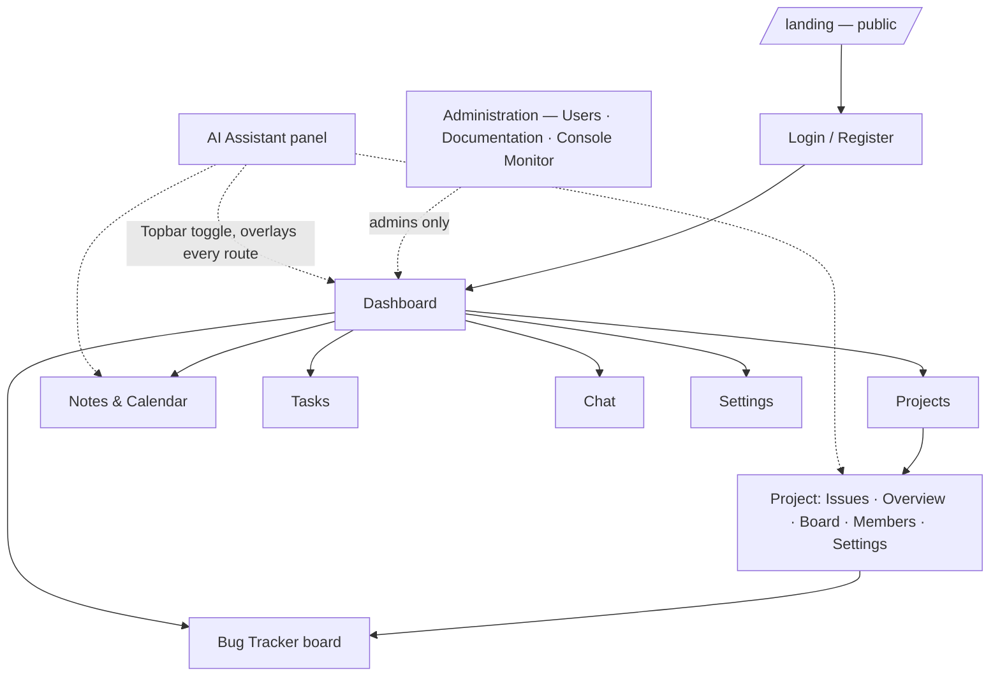

# User flow — ApexOps as shipped

> **Rewritten 2026-08-21** from `routes/AppRoutes.tsx`, `components/layout/Sidebar.tsx` and the
> pages themselves. This document used to be a *proposal* written during the 2026-07-24 UI teardown:
> which pages to rebuild, in what order. Everything it proposed has shipped or been decided, so it
> now describes the flow that exists. The original research is kept at the bottom as
> [history](#appendix--the-2026-07-24-rebuild-research), because two of its findings are still the
> reason the app is shaped the way it is — but its inventory table is no longer accurate and should
> not be read as current.

## The map

**Primary nav** (`Sidebar.tsx`): Dashboard · Projects · Bug Tracker · Tasks · Notes & Calendar ·
Chat. Then an **Administration** group rendered only for admins (Users, Documentation, Console
Monitor) and an **Account** group (Documentation, Settings).

**The assistant is not in the nav and should not be.** It is a Topbar toggle opening a right-hand
panel that belongs to no route: available everywhere, losing nothing when you navigate. It is an
assistant, not a destination.

**Public routes:** `/` (landing), `/login`, `/register`, `/docs`, `/docs/:slug`. Everything else is
behind `ProtectedRoute`; `/invite/:token` is authenticated too, because accepting an invite requires
an account.

---

## The journey the product exists for

**1. An error happens in someone's app.** The SDK posts it to `POST /api/ingest` with the project's
public key.

**2. It becomes an issue.** Identical errors collapse by fingerprint into one row with a count. A
resolved issue firing again reopens as a **regression** and notifies.

**3. Someone reads it** at `/p/:slug/issues` — filtered, sorted and paged server-side, with the
filter in the URL so the view can be pasted to a colleague. Detail (`/p/:slug/issues/:id`) shows the
latest event with **symbolicated** frames, a timeline, and browser/OS/release breakdowns.

**4. It becomes work.** *Create ticket* promotes the issue into a `Ticket` on the project board,
carrying the culprit, count, first-seen and latest stack across. Promoting twice returns the ticket
that already exists rather than making a second one.

**5. It gets worked.** `/p/:slug/board` or the cross-project `/bug-tracker`: status, priority,
assignee, tags, comments. Deleting archives; restore brings it back.

---

## Bug Tracker — what changed since this doc last described it

Two claims in the 2026-07-24 version are now wrong, and both would mislead someone planning work:

| Old claim | Reality on 2026-08-21 |
| --- | --- |
| "realtime already works" via `useBugTrackerSocket` | **That hook no longer exists.** `useConsoleMonitor.ts` took over the console feed; nothing took over tickets. The board fetches and refetches |
| Ticket CRUD is the feature | Tickets are **project-scoped** (`projectId` required) and **soft-deleted**, and the interesting path into them is *promotion from an issue*, not manual creation |

Live updating of the **issue list** is a different surface and it **is** shipped (merged
2026-08-21): the list patches counts in place, defers rows that do not match your filter behind an
*N new issues* banner, and carries a three-state badge that never reads `live` over a dead feed.

## AI Assistant — shipped, and BYOK is the reason it cost what it did

The old sequencing note called this "backend trivial, needs one new hook." Right about the endpoint,
wrong about the feature: the cost was **bring-your-own-key**. Letting each user spend their own
Gemini quota added a `UserAiKey` table, AES-256-GCM envelope encryption, a validate-before-write key
API, and a typed error vocabulary so a rejected key reads as *"re-enter your key"* rather than
*"invalid request"*.

In flow terms: the panel opens from any page; with no key stored it opens a key dialog first; keys
are proven against the provider before they are saved, so a typo is caught while the user is still
looking at the dialog rather than on their first message. Full write-up:
[`features/ai-assistant-byok.md`](../features/ai-assistant-byok.md).

## Notes, Tasks and Calendar

One dataset, two pages. `/notes` is notes plus a month grid (a note can be *scheduled* onto a future
day); `/tasks` is every task across every day, filterable by open, overdue and done. The old
`/daily` page is gone — folded into these two — which is why the `daily-notes` documentation page
was retired in favour of `tasks`.

## Chat

`/chat`, one-to-one, authenticated at the socket handshake and scoped to a room per conversation.
**Ephemeral by decision** (2026-08-21): messages are relayed, never stored, and the UI says so on
every thread.

---

## The three open questions this document used to carry — all now answered

| Question | Answer |
| --- | --- |
| A landing page before Auth, or straight to login? | **Landing page.** `/` is a public Luxe landing route; unauthenticated users are not dropped onto a form |
| Is Console Monitor user-facing, or a dev tool? | **Admin tool.** It sits at `/admin/console` under Administration, and the socket room re-checks role from the database rather than trusting the handshake |
| Is ephemeral chat acceptable for v1? | **Yes — decided, not deferred.** See [`features/chat.md`](../features/chat.md); the authorisation argument for a persistence model disappeared once room ids carried their own participants |

---

## Appendix — the 2026-07-24 rebuild research

Kept because it explains why the app is shaped this way. **Its feature inventory is out of date; do
not read it as current.**

The UI teardown left `/design-system` as the only route, with business logic sitting unwired in
`hooks/` and `services/`. Three findings came out of reading the schema and routes rather than
guessing:

**Finding 1 — Invoices had no backend.** No `Invoice` model, no route; the page was mock data. It
was never rebuilt, and it survives only as the lineage of the design system. *Still true.*

**Finding 2 — Calendar and OptimizationCalendar were the same data twice.** Both read the
Notes-backed calendar endpoint at different densities. Resolved by collapsing them into one page
with a mode toggle, exactly as recommended. *Acted on; `useOptimizationCalendarEvents` and
`utils/optimizationCalendar.ts` are gone.*

**Finding 3 — Chat's client logic did not survive the reset**, because it lived inside
`components/ui/chat/` rather than in `hooks/`. Rebuilt as `hooks/useChat.ts` + `services/chat.ts`,
and then **deliberately blocked** until the socket was authenticated and room-scoped — the security
work documented in [`features/chat.md`](../features/chat.md). *Shipped.*

The rebuild order it recommended — Dashboard, Bug Tracker, Notes+Calendar, Settings, then AI, then
Chat, with Console Monitor last — is what happened, with one correction already noted above: the AI
step was far larger than estimated, and Console Monitor ended up behind an admin gate rather than
merely deprioritised.
