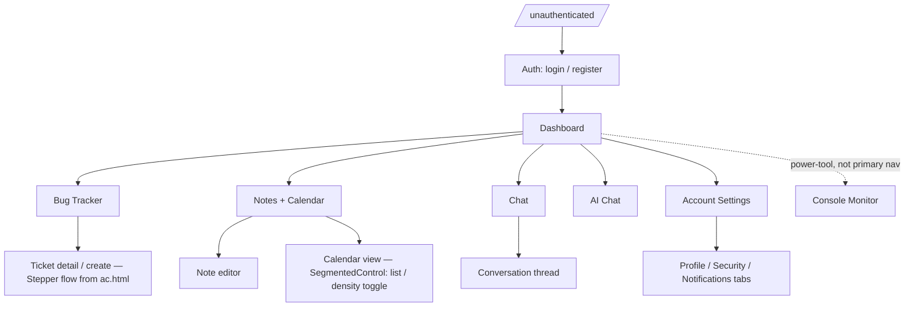

# Recommended user flow — post-reset rebuild

> Status: research + proposal. Owner: frontend/product.
> Written after the 2026-07-24 UI teardown (see [`ui-reset-2026-07-24.md`](../archive/ui-reset-2026-07-24.md)),
> which left `/design-system` as the only route and every other page's business logic sitting in
> `hooks/`/`services/` unwired. This doc answers the question that has to be settled *before*
> rebuilding: which pages, in what order, connected how.

## Method

Not guessed — derived from what the app can actually do, checked in this order:

1. **`database/prisma/schema.prisma`** — the real data model: `User`, `UserSettings`, `Ticket`,
   `Log`, `Note`, `RefreshToken`. No `Invoice` model. No `Event`/`CalendarEvent` model.
2. **`app/server/src/api/*.ts`** — every real endpoint (`auth`, `tickets`, `logs`, `notes`, `chat`,
   `ai`, `console-logs`, `console-monitor`).
3. **`app/client/src/hooks/*` and `services/*`** — what survived the reset unwired, i.e. what
   doesn't need to be rebuilt from scratch, only re-wired to new UI.
4. **`.agents/design-system/design.md`** and **`template-adoption.md`** — what visual/interaction
   patterns already exist (primitives, scaffolds, template mapping) to build each flow on.

This surfaced two findings that change the shape of the flow, not just its styling:

### Finding 1 — Invoices has no backend

`services/api.ts` and `services/auth.ts` are the only API services that survived, and neither
touches invoices. There is no `Invoice` model in Prisma and no `/api/invoices` route anywhere in
`app/server`. The old `Invoices.tsx` page (and the whole `components/ui/invoices/` folder, 11
files) was **always mock data** — it exists because it's the page `design-system/design.md` was
extracted from, not because the product has a billing feature.

**Consequence for the flow: Invoices is not a primary node.** It stays as design-system lineage
(already documented in `design.md`), not as a rebuilt page, unless a real invoicing requirement
shows up later with backend work to match.

### Finding 2 — Calendar and OptimizationCalendar are the same data, twice

`hooks/useCalendarEvents.ts` calls `services/calendar.ts` → `GET /api/notes/calendar/:year/:month`.
`hooks/useOptimizationCalendarEvents.ts` wraps `useCalendarEvents` and runs the result through
`utils/optimizationCalendar.ts`'s `mapNotesToCalendarEvents`. **Both pages read the exact same
Notes-backed endpoint** — there is no separate scheduling/events model. `OptimizationCalendar.tsx`
was 1,132 lines because it added a denser reducer-based view over identical data, not because it
served a different feature.

**Consequence for the flow: one Calendar screen, not two.** The "optimization" density/view can be
a mode toggle (`SegmentedControl`, already built) inside a single Calendar page instead of a
separate route users have to discover and choose between.

### Finding 3 — Chat's client logic did not survive the reset

Bug tracker, notes, and calendar all have their state/data logic in top-level `hooks/` — the reset
explicitly preserved that. Chat's logic (`useChatController.ts`, `chatApi.ts`, `chatTypes.ts`) lived
inside `components/ui/chat/`, which was deleted as UI, not logic. **Only the backend
(`GET /api/chat/users`) and generic types remain.** Rebuilding Chat costs materially more than
rebuilding Bug Tracker/Notes/Calendar — that has to factor into sequencing, not just page order.

---

## Feature inventory (grounded in real endpoints)

| Feature | Backend | Frontend logic status | Existing scaffold |
|---|---|---|---|
| **Auth** | `POST /register /login /refresh /logout`, `GET/PUT /profile`, `PUT /settings /password` | `services/auth.ts`, `context/AuthContext.tsx` — intact | none yet |
| **Dashboard** (KPI overview) | Reads Tickets + Logs stats | Rebuilt once already this session (deleted in the reset, pattern proven) | `DashboardShellLayout` + `ProjectAnalyticsLayout` (zb.html/af.html) |
| **Bug Tracker** | `Ticket` CRUD + stats, `useBugTrackerSocket` for realtime | `hooks/useBugTrackerData.ts`, `useBugTrackerSocket.ts` — intact | `WorkspaceBoardLayout` (aj.html) + `Stepper`/`AvatarStack` (ac.html IA) |
| **Logs / Console Monitor** | `Log` CRUD + stats + batch; separate multi-session Puppeteer capture (`console-monitor.ts`, session-owner-gated) | no surviving hook — was folded into Dashboard/BugTracker views before | none yet — closest template fit is `zc.html`'s dense record rows |
| **Notes + Calendar** (merged per Finding 2) | `Note` CRUD, `stats/overview`, `calendar/:year/:month` | `hooks/useNoteList.ts`, `hooks/useCalendarEvents.ts`, `services/notes.ts`, `services/calendar.ts`, `types/notes.ts`. *(`useNoteStatsOverview`, `useNoteAiChat` and `useOptimizationCalendarEvents` were deleted as dead code; the note modules moved out of `components/ui/` on 2026-08-15.)* | `TimelineLayout` (zc.html) + `GanttTrack` |
| **Chat** (interpersonal) | `GET /api/chat/users` only | **gone** — needs a new hook + socket wiring from spec in `devrule.md` §8 | `zd.html`'s contact rail (documented, not scaffolded) |
| **AI Chat** (Gemini assistant) | `POST /api/ai/chat`, `GET /api/ai/status` | **no client hook at all** — `useNoteAiChat.ts` was the last caller and was deleted as dead code 2026-08-15; both endpoints are still live and mounted | none yet |
| **Account Settings** | `PUT /profile /settings /password` | logic lives directly in `services/auth.ts` + `AuthContext`, no dedicated hook | none yet |
| **Invoices** | none (Finding 1) | mock-only, was never real | `ai.html` — origin of the design system, not a route |

---

## Proposed flow

**Entry.** Unauthenticated users land on Auth (login/register) — there is currently no public
landing page (`Homepage.tsx` was deleted along with everything else). Whether a marketing/landing
page belongs in front of Auth is a product call, not something the backend or existing logic
dictates either way — flagging it rather than deciding it here.

**Home base.** Dashboard is the post-login landing page — it's the one page already proven to work
end-to-end this session (shadcn Alert + `StatTile`/`Surface`/`motion`, real ticket/log data,
verified in-browser). Rebuilding it first again gives every other page a working reference
instead of a description.

**Primary nav (4 items, not 7).** Bug Tracker, Notes+Calendar, Chat, Account Settings. AI Chat can
live as an entry point from either Notes or Dashboard rather
than needing its own top-level nav slot — it's an assistant, not a destination. Console Monitor is
a real, working feature (session-scoped Puppeteer capture) but it's a power-tool for debugging a
running app, not a screen most users open often — surface it from Logs/Bug Tracker context, not
primary nav.

**Why 4 nav items instead of the old 9 routes:** the old app had `/chat`, `/chat-optimized`,
`/chat/new`, `/ai-chat` as four separate top-level routes for what is really one feature (talk to
someone or something) plus `/calendar` and `/optimization-calendar` as two routes for one dataset.
Collapsing both is lower risk *and* less to rebuild — the flow research and the "least UI to
rebuild" incentive point the same direction here, which is a good sign it's the right call rather
than a compromise.

---

## Rebuild sequencing recommendation

1. **Dashboard** — already done once, delete-proof now that the pattern (shadcn Alert +
   design-system primitives + untouched hooks) is documented in `ui-reset-2026-07-24.md`. Rebuild
   it again first; it's the cheapest page and everything else links back to it.
2. **Bug Tracker** — richest surviving logic (`useBugTrackerData` + `useBugTrackerSocket`, i.e.
   realtime already works), richest scaffold (`WorkspaceBoardLayout`), and the `ac.html` stepped
   create-flow gives ticket creation a real IA instead of a modal afterthought.
3. **Notes + Calendar, merged** — second-richest logic surface (4 hooks), `TimelineLayout` ready.
   Building it as one page from the start avoids doing the merge as a *second* migration later.
4. **Account Settings** — no hook to write, `services/auth.ts` already does the work; mostly a
   forms-and-tabs UI exercise once the pattern from steps 1–3 is established.
5. **AI Chat** — backend trivial (`POST /api/ai/chat`, live and mounted), needs one new hook. The
   `useNoteAiChat.ts` that this step said to copy was deleted as dead code on 2026-08-15, so the
   hook now gets written from scratch against the endpoint rather than adapted.
6. **Chat (interpersonal)** — last, because it's the only feature needing a new hook *and* new
   socket wiring *and* new UI, with the smallest backend surface (`/users` only — presence/message
   history endpoints don't exist yet either). Doing it last means the socket.io client pattern from
   `devrule.md` §8 gets written once real usage patterns from Bug Tracker's socket hook are proven.
7. **Console Monitor** — whenever a debugging power-tool is actually needed; not on the critical
   path for a usable app.

## Update — 2026-07-24: Calendar merged, Chat hook rebuilt

Acted on this doc's own findings:

- **Finding 2 (Calendar duplication) resolved in code.** `hooks/useOptimizationCalendarEvents.ts`
  and `utils/optimizationCalendar.ts` are gone; `hooks/useCalendarEvents.ts` now returns the
  richer shape itself (`events`, `eventsByDay`, `dispatch`, `totalNotes`) — one hook for the one
  Calendar page this doc recommended, not two.
- **Finding 3 (Chat logic) addressed.** New `hooks/useChat.ts` + `services/chat.ts` +
  `types/chat.ts`, built directly against `app/server/src/server.ts`'s actual Socket.IO handlers
  (`register` with `clientType: 'chat'`, `chat-message`, `user-typing` — same server
  `useBugTrackerSocket.ts` already connects to). Still needs a page/UI built on top.
- **`types/invoice.ts` removed** — confirmed zero references before deleting (Finding 1: it was
  already dead, the Invoices page having been removed in the reset).

This also answered one open question below from the server source directly: `server.ts` comments
the chat registry as *"Instagram-style DM demo"* — **1:1 only, confirmed**, not group chat. No
message-persistence model or history endpoint exists either way, so `useChat.ts` is intentionally
ephemeral (messages live only as long as the socket connection).

## Open questions for you, not decidable from code

- **Landing page before Auth** — rebuild `Homepage.tsx`'s Luxe landing content, or go straight to
  a login screen?
- **Console Monitor's audience** — genuinely user-facing, or should it move behind a settings/dev
  toggle so it stops competing for primary-nav attention?
- **Chat message persistence** — is ephemeral (reload = history gone) acceptable for a v1, or does
  a `ChatMessage` model + history endpoint need to be added to the backend before Chat ships?
